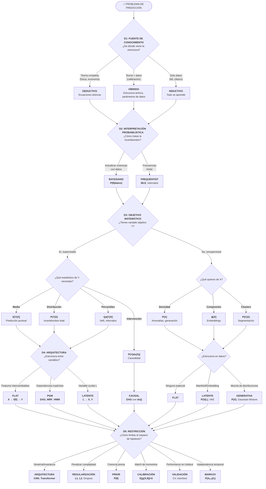

# Taxonomía de la Predicción en IA

Una guía completa para entender cómo se aproxima el problema de predicción desde diferentes perspectivas.

---

## Parte 0: El Problema Fundamental

### ¿Qué es predecir?

En su forma más general, **predecir** es estimar alguna cantidad desconocida a partir de información disponible.

**Notación**:
- **Y**: Variable objetivo (lo que queremos predecir)
- **X**: Variables observables / features
- **Z**: Información auxiliar observable / proxies
- **L**: Variable latente (no observada, inferida por el modelo)
- **C**: Cluster o categoría discreta
- **θ**: Parámetros del modelo

### El objetivo matemático

Dependiendo del contexto, podemos querer estimar diferentes cantidades. Cada una responde a una pregunta diferente:

**Nota importante sobre la notación:**
En estas notas usamos **E[·]** (valor esperado/media) como el estadístico principal por ser el más común en la práctica. Sin embargo, formalmente podríamos querer estimar **cualquier funcional o estadístico** de la distribución:

| Estadístico | Notación | Cuándo usarlo |
|-------------|----------|---------------|
| **Media** | E[Y\|X] | Predicción puntual, minimiza MSE |
| **Mediana** | Q₀.₅[Y\|X] | Robusto a outliers, minimiza MAE |
| **Quantiles** | Qα[Y\|X] | Riesgo (VaR), intervalos de predicción |
| **Varianza** | Var[Y\|X] | Incertidumbre, volatilidad |
| **Moda** | Mode[Y\|X] | Valor más probable |

Donde dice **E[Y\|X]**, léase como "un estadístico de Y dado X" - la media es simplemente el caso más frecuente.

| Objetivo | Notación | Descripción |
|----------|----------|-------------|
| Distribución marginal de Y | **P(Y)** | Distribución de Y sin condicionar en nada |
| Media incondicional | **E[Y]** | Solo la media de Y (el baseline más simple) |
| Distribución condicional completa | **P(Y\|X,Z)** | Toda la forma de la distribución de Y dado X y Z |
| Valor esperado condicional | **E[Y\|X,Z]** | Solo la media de Y dado X y Z |
| Distribución de los datos | **P(X)** o **P(X,Z)** | La densidad de los inputs (sin objetivo) |
| Representación | **ϕ(X) → ℝᵈ** | Un embedding o compresión de X |
| Efecto causal | **P(Y\|do(X))** | El resultado de *intervenir* en X |

#### Explicación de cada objetivo:

**P(Y) - Distribución marginal**
> "¿Cómo se distribuye Y en general, sin saber nada más?"

Es la distribución de Y ignorando cualquier información de X o Z. Es el punto de partida: si no conoces ningún feature, ¿qué puedes decir de Y?

*Ejemplo*: Distribución de retornos diarios del S&P 500. Sin saber nada del contexto (qué día es, qué pasó en el mercado), ¿cuál es la probabilidad de un retorno de +2%? La respuesta está en P(Y).

**E[Y] - Media incondicional (el baseline)**
> "¿Cuál es el promedio histórico de Y?"

Es el predictor más simple posible cuando no tienes features. **Todo modelo más complejo debe superar este baseline** para justificar su complejidad.

**Nota**: El "mejor" estadístico incondicional depende de la función de pérdida:
| Si minimizas... | El baseline óptimo es... | Notación |
|-----------------|-------------------------|----------|
| Error cuadrático (MSE) | **Media** | E[Y] |
| Error absoluto (MAE) | **Mediana** | Q₀.₅[Y] |
| Pérdida asimétrica | **Quantil** correspondiente | Qα[Y] |

*Ejemplo*: "El precio promedio de una casa es $300,000". Si tu modelo sofisticado con 50 features no supera esta predicción naive, algo está mal. E[Y] es el piso mínimo de performance (para MSE).

**P(Y|X) - Distribución condicional completa**
> "Dado que observo X, ¿cuál es la distribución completa de posibles valores de Y?"

No solo te dice el valor más probable, sino toda la forma: ¿es simétrica? ¿tiene colas pesadas? ¿es multimodal? Esto es crucial cuando necesitas cuantificar incertidumbre.

*Ejemplo*: Pronóstico del clima. No solo "mañana habrá 20°C", sino la distribución completa: 10% probabilidad de <15°C, 60% de 18-22°C, 30% de >22°C.

**E[Y|X] - Valor esperado (media condicional)**
> "Dado que observo X, ¿cuál es el valor promedio esperado de Y?"

Es un solo número - el "mejor guess" en sentido de mínimo error cuadrático. Pierdes información sobre variabilidad.

*Ejemplo*: Predicción de precio de casa. El modelo dice "$250,000" - un número, no una distribución.

**Nota sobre series de tiempo:**
Las series de tiempo son un caso especial donde los features X son la **historia de la misma variable Y**:
- **P(Y_{t+1} | Y_t, Y_{t-1}, ...)** es P(Y|X) donde X = {Y_t, Y_{t-1}, ...}
- Modelos como AR, ARIMA, LSTM, y Transformers temporales usan esta estructura
- El baseline **E[Y]** sigue siendo relevante: un modelo temporal que no supere "predecir la media histórica" no aporta valor
- También existe el baseline "naive" de series de tiempo: predecir Y_{t+1} = Y_t (el último valor observado)

**La propiedad de Markov (memorylessness):**
Una simplificación poderosa es asumir que **solo el presente importa**:
- **P(Y_{t+1} | Y_t, Y_{t-1}, ...) = P(Y_{t+1} | Y_t)** ← Propiedad de Markov
- "El futuro es independiente del pasado dado el presente"
- Reduce drásticamente la complejidad: de historia infinita a un solo estado
- Es un supuesto **deductivo/híbrido**: decides a priori que la historia lejana es irrelevante
- Modelos: Cadenas de Markov, Hidden Markov Models (HMM), filtros de Kalman

**P(X) - Distribución de los datos**
> "¿Cuál es la probabilidad de observar este input X?"

No hay variable objetivo Y. Modelas cómo se distribuyen los datos en sí mismos.

*Ejemplo*: Detección de fraude. Si P(transacción) es muy baja, la transacción es "rara" → posible fraude.

**ϕ(X) → ℝᵈ - Representación (embedding)**
> "¿Cómo puedo comprimir X en un vector de dimensión menor que capture su esencia?"

Es una función determinista que mapea inputs a un espacio de menor dimensión. No es probabilístico.

*Ejemplo*: Word2Vec convierte palabras en vectores de 300 dimensiones donde "rey - hombre + mujer ≈ reina".

**P(Y|do(X)) - Efecto causal (intervención)**
> "Si yo CAMBIO X activamente, ¿qué pasa con Y?"

Es diferente de P(Y|X) que solo pregunta "si OBSERVO X". La diferencia es crucial:
- P(Y|X): "Las personas que toman aspirina tienen menos infartos" (correlación)
- P(Y|do(X)): "Si le DOY aspirina a alguien, ¿tendrá menos infartos?" (causación)

*Ejemplo*: Si observas que ciudades con más heladerías tienen más crimen, P(crimen|heladerías) es alto. Pero P(crimen|do(cerrar heladerías)) no baja el crimen - ambos son causados por el calor.

### Jerarquía de generalidad

```
                                    Más información / Más general
                                              ▲
                                              │
┌─────────────────────────────────────────────┴─────────────────────────────────────────────┐
│                                                                                           │
│   P(X,Y,Z)  ─────────────────────── Distribución conjunta completa                        │
│       │                                                                                   │
│       ├──► P(Y|X,Z) ──► E[Y|X,Z] ──► Predicción condicional                               │
│       │        │                                                                          │
│       │        └──► Var[Y|X,Z], Q_α[Y|X,Z] ──► Varianza, quantiles                        │
│       │                                                                                   │
│       ├──► P(Y) ──► E[Y] ──► Baseline (predicción sin features)                           │
│       │                                                                                   │
│       ├──► P(X,Z) ──► P(X) ──► Generación, detección de anomalías                         │
│       │                 │                                                                 │
│       │                 └──► ϕ(X) ──► Representación (compresión con pérdida)             │
│       │                                                                                   │
│       └──► P(X|Y) ──► Inferencia inversa (¿qué X generó este Y?)                          │
│                                                                                           │
└───────────────────────────────────────────────────────────────────────────────────────────┘
                                              │
                                              ▼
                                    Menos información / Más específico


    ¿Y el efecto causal P(Y|do(X))?
    
    P(Y|do(X)) NO se deriva de P(X,Y) directamente. Requiere información adicional:
    estructura causal (un DAG) que te dice qué variables causan qué.
    
    P(X,Y,Z) + Estructura Causal ──► P(Y|do(X))
```

**Regla clave**: Si conoces una cantidad más general (arriba), puedes derivar las más específicas (abajo). No al revés.

**¿Por qué ϕ(X) está "debajo" de P(X)?**
- De P(X) puedes derivar muchas representaciones ϕ(X) (ej: los modos de la distribución, componentes principales)
- De ϕ(X) no puedes recuperar P(X) - perdiste información al comprimir

**¿Por qué P(Y|do(X)) está separado?**
- No puedes derivar efectos causales solo de datos observacionales P(X,Y)
- Necesitas supuestos adicionales sobre la estructura causal
- Por eso causalidad requiere más que solo "más datos"

**¿Por qué E[Y] importa como baseline?**

E[Y] es el **baseline universal** contra el que todo modelo predictivo debe compararse:
- Si tu modelo E[Y|X] no mejora sobre predecir E[Y] siempre, los features X no aportan información útil
- En ML esto se mide con métricas como **R²** (qué porcentaje de varianza explica el modelo sobre el baseline)
- Un R² de 0 significa: "mi modelo sofisticado no es mejor que predecir la media"
- Un R² negativo significa: "mi modelo es PEOR que predecir la media" (sobreajuste o error)

La pregunta fundamental antes de construir cualquier modelo complejo es: **¿Mis features X realmente ayudan a predecir Y mejor que simplemente usar E[Y]?**

Por ejemplo:
- De **P(Y|X)** puedes calcular **E[Y|X] = ∫ y · P(y|X) dy**
- De **E[Y|X]** **no puedes** recuperar **P(Y|X)** (perdiste información sobre varianza, forma, etc.)

### El problema fundamental: Restricción

**El dilema**:
- Tenemos **datos finitos** (N observaciones)
- El espacio de funciones posibles es **infinito**
- Hay infinitos modelos que ajustan perfectamente los datos de entrenamiento

**Consecuencia**: 
Todo método de predicción es una forma de **restringir el espacio de hipótesis**. Las diferencias entre métodos son diferencias en:
1. **Qué restricciones** imponen
2. **De dónde vienen** esas restricciones
3. **Cómo se expresan** matemáticamente

Esta es la base de nuestra taxonomía.

---

## Parte 1: Las 5 Dimensiones Ortogonales

No existe UNA forma correcta de categorizar los métodos de predicción. Existen **5 ejes independientes** que caracterizan cualquier approach. Cada método es un punto en este espacio 5-dimensional.

```
Método = (D1: Fuente de Estructura, 
          D2: Interpretación de Probabilidad, 
          D3: Objetivo Matemático, 
          D4: Arquitectura de Variables, 
          D5: Mecanismo de Restricción)
```

Las dimensiones son **ortogonales**: puedes elegir cualquier combinación de opciones en cada eje.

---

### Dimensión 1: Fuente del Conocimiento Estructural

**Pregunta clave**: *"¿De dónde viene la estructura del modelo?"*

Esta es quizás la dimensión más fundamental. Antes de hablar de algoritmos o matemáticas, debemos preguntarnos: ¿qué **sabemos** (o creemos saber) sobre el problema antes de ver los datos?

| Tipo | Descripción | Ejemplos | Situación real |
|------|-------------|----------|----------------|
| **Deductivo** | La estructura viene de teoría/axiomas previos a los datos | Modelos físicos, DSGE en economía, sistemas expertos | *Simulación de vuelo*: ecuaciones de aerodinámica definen el modelo, datos solo validan |
| **Inductivo** | La estructura emerge de patrones en los datos | ML clásico, Deep Learning, clustering | *Recomendador de Netflix*: no hay "teoría de gustos", solo patrones en millones de usuarios |
| **Híbrido** | Teoría provee esqueleto, datos ajustan parámetros | Calibración económica, Physics-Informed NNs, Bayesian con priors informativos | *Modelo macroeconómico*: teoría dice que consumo depende de ingreso esperado, datos calibran elasticidades |

---

#### Enfoque Deductivo: "La teoría primero"

En el enfoque deductivo, **la estructura del modelo existe antes de ver cualquier dato**. Viene de:
- Leyes físicas (Newton, Maxwell, termodinámica)
- Axiomas económicos (optimización de agentes, equilibrio de mercados)
- Lógica formal (reglas de inferencia, ontologías)

**Flujo deductivo:**
```
Axiomas/Teoría  ──►  Modelo Matemático  ──►  Predicciones  ──►  Datos validan/refutan
```

**Características:**
- El modelo puede existir sin datos (ej: ecuaciones de Einstein existían antes de confirmarlas)
- Los datos sirven para **validar** o **refutar**, no para descubrir estructura
- Alta interpretabilidad: cada término tiene significado teórico
- Puede fallar si la teoría está equivocada

**Ejemplo detallado - Física:**
Las ecuaciones de Navier-Stokes describen fluidos. No las "aprendimos" de datos - las derivamos de principios de conservación (masa, momento, energía). Un simulador de clima usa estas ecuaciones; los datos solo calibran condiciones iniciales.

**Ejemplo detallado - Economía (DSGE):**
Un modelo DSGE parte de supuestos: hogares maximizan utilidad, firmas maximizan ganancias, mercados se equilibran. De estos axiomas se derivan ecuaciones (Euler, Phillips). La estructura está fijada; los datos solo determinan valores de parámetros como elasticidades.

---

#### Enfoque Inductivo: "Los datos primero"

En el enfoque inductivo, **la estructura emerge de los patrones en los datos**. No hay teoría previa que dicte la forma funcional.

**Flujo inductivo:**
```
Datos  ──►  Buscar patrones  ──►  Modelo que ajusta  ──►  Predicciones
```

**Características:**
- Sin datos, no hay modelo
- El modelo "descubre" relaciones que no conocíamos
- Puede encontrar patrones no lineales, interacciones complejas
- Riesgo: puede encontrar patrones espurios (correlación sin causación)
- Menor interpretabilidad: ¿qué significa el peso 0.73 en la capa 5?

**Ejemplo detallado - Recomendador de Netflix:**
No existe una "teoría de gustos cinematográficos" que diga que si te gusta X, te gustará Y. El sistema observa millones de usuarios, encuentra patrones (gente que vio A también vio B), y los explota. La estructura (qué factores importan) emerge de los datos.

**Ejemplo detallado - Reconocimiento de imágenes:**
No hay axiomas que digan "un gato tiene orejas puntiagudas y bigotes". La red neuronal ve millones de imágenes etiquetadas y aprende features discriminativas. Nadie programó qué buscar.

---

#### Enfoque Híbrido: "Lo mejor de ambos mundos"

El enfoque híbrido combina conocimiento teórico con aprendizaje de datos. La teoría provee el **esqueleto**, los datos ajustan los **detalles**.

**Flujo híbrido:**
```
Teoría parcial  ──►  Estructura con "huecos"  ──►  Datos llenan huecos  ──►  Modelo completo
```

**Variantes del enfoque híbrido:**

| Variante | Qué provee la teoría | Qué proveen los datos |
|----------|---------------------|----------------------|
| **Calibración** | Forma funcional completa | Valores de parámetros |
| **Physics-Informed NN** | Restricciones (ej: conservación de energía) | Función de aproximación |
| **Priors informativos** | Distribución a priori sobre parámetros | Actualización posterior |
| **Modelos semi-paramétricos** | Parte paramétrica (teoría) | Parte no-paramétrica (datos) |

**Ejemplo detallado - Calibración económica:**
Un modelo macroeconómico tiene la forma: `C = f(Y, r, θ)` donde:
- La teoría dice que Consumo (C) depende de Ingreso (Y) y tasa de interés (r)
- La forma funcional f viene de optimización de hogares
- Pero el parámetro θ (elasticidad) no lo dice la teoría
- Los datos determinan θ mediante match de momentos (ej: ajustar para que el modelo reproduzca la volatilidad observada del PIB)

**Ejemplo detallado - Physics-Informed Neural Networks:**
Quieres predecir el flujo de calor en un material. Sabes que debe satisfacer la ecuación de calor (∂T/∂t = α∇²T). En lugar de solo minimizar error de predicción, agregas un término al loss que penaliza violar la ecuación. La red aprende una función que:
1. Ajusta los datos observados
2. Respeta la física conocida

---

**El caso de la calibración económica (expandido):** 

La calibración es el ejemplo canónico de enfoque híbrido en ciencias sociales:

```
┌─────────────────────────────────────────────────────────────────────┐
│                                                                     │
│   TEORÍA (Deductivo)                    DATOS (Inductivo)          │
│   ─────────────────                     ────────────────           │
│   • Hogares maximizan utilidad          • Series de tiempo del PIB │
│   • Firmas maximizan ganancias          • Inflación observada      │
│   • Mercados se equilibran              • Tasas de interés         │
│            │                                     │                  │
│            ▼                                     ▼                  │
│   Ecuaciones estructurales              Momentos empíricos         │
│   (Euler, Phillips, etc.)               (media, varianza, corr)    │
│            │                                     │                  │
│            └──────────────┬──────────────────────┘                  │
│                           ▼                                         │
│                    CALIBRACIÓN                                      │
│            Encontrar θ tal que momentos del                         │
│            modelo ≈ momentos de los datos                           │
│                           │                                         │
│                           ▼                                         │
│                  Modelo calibrado                                   │
│            (estructura teórica + parámetros empíricos)              │
│                                                                     │
└─────────────────────────────────────────────────────────────────────┘
```

La teoría te dice *qué* variables se relacionan y *cómo* (funcionalmente). Los datos te dicen los *valores numéricos* de los parámetros.

**Nota importante: DSGE vs Calibración**

Es común confundir estos términos porque suelen aparecer juntos, pero son cosas distintas:

| Concepto | ¿Qué es? | Dimensión |
|----------|----------|-----------|
| **DSGE** | Un **tipo de modelo** (estructura basada en teoría micro: agentes optimizando, equilibrio general) | D1 (Deductivo) + D4 (Arquitectura de grafo/ecuaciones) |
| **Calibración** | Una **técnica de estimación** (elegir parámetros para reproducir momentos observados) | D5 (Mecanismo de restricción) |

```
DSGE puede estimarse con:        Calibración puede aplicarse a:
├── Calibración ←──────────────→ ├── DSGE
├── Maximum Likelihood           ├── Modelos de agentes
├── Bayesiano                    ├── Simulaciones físicas
└── GMM (Momentos Generalizados) └── Cualquier modelo con parámetros libres
```

En otras palabras: **DSGE es el "qué"** (qué modelo usas), **calibración es el "cómo"** (cómo estimas sus parámetros).

---

**Intuición resumida:**
- **Deductivo**: "Sé cómo funciona el mundo; los datos confirman"
- **Inductivo**: "No sé cómo funciona; los datos me lo dirán"
- **Híbrido**: "Tengo una idea aproximada; los datos la refinan"

**¿Cuándo usar cada uno?**

| Situación | Enfoque recomendado |
|-----------|---------------------|
| Tienes teoría sólida y bien establecida | Deductivo |
| No hay teoría, solo datos abundantes | Inductivo |
| Teoría parcial + necesitas generalizar | Híbrido |
| Datos escasos pero conocimiento experto | Híbrido (priors) |
| Necesitas interpretabilidad/explicabilidad | Deductivo o Híbrido |
| Solo importa precisión predictiva | Inductivo |

---

### Dimensión 2: Interpretación de Probabilidad/Incertidumbre

**Pregunta clave**: *"Cuando digo 'hay 70% de probabilidad de lluvia', ¿qué significa ese número?"*

| Interpretación | Filosofía | Qué es un parámetro **θ** | Qué es incertidumbre | Situación real |
|----------------|-----------|------------------------------|----------------------|----------------|
| **Frequentist** | Probabilidad = frecuencia límite en repeticiones infinitas | Constante fija desconocida | Variabilidad muestral | *A/B testing*: "si repitiera el experimento infinitas veces, ¿qué fracción favorece A?" |
| **Bayesian** | Probabilidad = grado de creencia subjetivo | Variable aleatoria con distribución | Se actualiza con evidencia | *Diagnóstico médico*: "dado el historial del paciente, mi creencia de que tiene X es 30%" |
| **Propensity** | Probabilidad = tendencia inherente del sistema | Propiedad del mecanismo causal | Irreducible, parte de la realidad | *Física cuántica*: la probabilidad es propiedad del electrón, no de nuestra ignorancia |

---

#### Nota filosófica: Tipos de incertidumbre y el debate Popper-Jaynes

La distinción entre interpretaciones tiene raíces filosóficas profundas sobre la **naturaleza de la incertidumbre**:

**Karl Popper y la Propensity:**
Popper argumentó que la probabilidad puede ser una **tendencia objetiva** del mundo físico - una "propensión" real del sistema a producir ciertos resultados. Bajo esta vista, cuando decimos que un electrón tiene 50% de probabilidad de spin-up, esto es una propiedad física del electrón, no de nuestro conocimiento.

**E.T. Jaynes y la incertidumbre epistémica:**
En *"Probability Theory: The Logic of Science"*, Jaynes argumenta algo diferente. Considera el ejemplo de una **urna con bolas** o una **baraja de cartas**:

> Cuando asignamos P = 1/52 a sacar el As de Espadas de una baraja "bien barajada", ¿es porque la baraja tiene una "propensión" objetiva? 

Jaynes diría: **No**. La baraja tiene un orden físico determinado después de barajar. Si conociéramos exactamente:
- La posición inicial de cada carta
- La mecánica exacta de cada movimiento del barajeo
- Las propiedades físicas de las cartas

...podríamos predecir el orden final con certeza. La probabilidad 1/52 refleja **nuestra ignorancia** (o nuestra decisión de no modelar la física), no una propiedad de la baraja.

**Dos tipos de incertidumbre:**

| Tipo | Nombre | Descripción | ¿Reducible? | Ejemplo |
|------|--------|-------------|-------------|---------|
| **Epistémica** | "No sé" | Incertidumbre por falta de conocimiento | Sí, con más información | Baraja: no conozco el orden, pero existe uno |
| **Aleatoria** | "No se puede saber" | Incertidumbre irreducible del sistema | No, es fundamental | ¿Mecánica cuántica? (debatido) |

**La posición de Jaynes:**
Para Jaynes, casi toda la "aleatoriedad" que usamos en estadística y ML es realmente **epistémica disfrazada**. Modelamos urnas, dados, y barajas como "aleatorios" porque:
1. No conocemos los detalles mecánicos
2. No queremos (o no podemos) modelarlos
3. La aproximación probabilística funciona bien en la práctica

Esto no significa que la probabilidad sea inútil - al contrario, Jaynes la defiende como **la herramienta correcta para razonar bajo incertidumbre**. Pero es honesto sobre su naturaleza: describe nuestro estado de conocimiento, no necesariamente el mundo.

**Implicación práctica:**
En ML, la distinción aparece como:
- **Incertidumbre epistémica** → Incertidumbre sobre los parámetros del modelo (reducible con más datos)
- **Incertidumbre aleatoria (aleatoric)** → "Ruido" en los datos (supuestamente irreducible)

Pero siguiendo a Jaynes, incluso lo que llamamos "ruido aleatorio" puede ser epistémico - variables que no medimos o no incluimos en el modelo.

---

**Implicaciones prácticas**:

| Aspecto | Frequentist | Bayesian |
|---------|-------------|----------|
| Output del modelo | Punto óptimo **θ̂** | Distribución **P(θ\|Data)** |
| Intervalos de confianza | "Si repitiera, 95% contendrían el verdadero valor" | "Hay 95% de probabilidad de que **θ** esté aquí" |
| Priors | No existen (o son implícitos) | Explícitos y requeridos |
| Computación | Típicamente más simple | Típicamente más costosa (MCMC, VI) |

**Nota importante**: Puedes ser Deductivo+Frequentist, Deductivo+Bayesian, Inductivo+Frequentist, Inductivo+Bayesian. Son ejes independientes.

---

### Dimensión 3: Objetivo Matemático

**Pregunta clave**: *"¿Qué cantidad estás tratando de estimar?"*

**Nota sobre notación de variables:**
| Símbolo | Significado | Ejemplo |
|---------|-------------|---------|
| **X** | Features/inputs observados | Imagen, texto, mediciones |
| **Y** | Variable objetivo a predecir | Etiqueta, precio, categoría |
| **Z** | Variable auxiliar observada (información extra) | Metadata, contexto, otra modalidad |
| **L** | Variable latente (no observada, inferida) | Representación comprimida, estado oculto |
| **C** | Cluster o categoría discreta | Segmento de cliente, tópico |

La diferencia clave: **Z es observable** (la tienes en tus datos), **L es latente** (la infiere el modelo).

#### Caso A: CON variable objetivo Y (Supervised)

| Objetivo | Notación | Qué obtienes | Cuándo usarlo | Situación real |
|----------|----------|--------------|---------------|----------------|
| **Distribución condicional** | **P(Y\|X)** | Forma completa de la distribución | Necesitas incertidumbre completa | *Pronóstico meteorológico*: no solo "lloverá" sino probabilidad por intensidad |
| **Valor esperado** | **E[Y\|X]** | Solo la media | Predicción puntual suficiente | *Precio de casa*: quieres UN número |
| **Efecto causal** | **P(Y\|do(X))** | Resultado de intervención | Decisiones, políticas | *Pricing*: ¿qué pasa si CAMBIO el precio del producto? |
| **Quantiles/Intervalos** | **Qα(Y\|X)** | Percentiles específicos | Riesgo, predicción robusta | *VaR en finanzas*: ¿cuál es la pérdida máxima al 95%? |

#### Caso B: SIN variable objetivo (Unsupervised)

| Objetivo | Notación | Qué obtienes | Cuándo usarlo | Situación real |
|----------|----------|--------------|---------------|----------------|
| **Distribución de datos** | **P(X)** | Densidad de probabilidad | Detección de anomalías, generación | *Fraude*: transacciones con baja **P(X)** son sospechosas |
| **Representación** | **ϕ(X) → L** | Embedding/compresión (L es latente) | Reducción de dimensión, transfer | *Autoencoder*: comprimir imágenes; *BERT*: embeddings de texto |
| **Estructura latente discreta** | **P(C\|X)** | Asignación a clusters | Segmentación, taxonomía | *Segmentar clientes* en grupos de comportamiento |
| **Reconstrucción** | **E[X]** o **X̂** | Versión "limpia" de input | Denoising, imputación | *Restaurar imagen borrosa*, completar datos faltantes |

#### Caso C: MIXTO (Self-supervised, Generativo)

| Objetivo | Notación | Qué obtienes | Cuándo usarlo | Situación real |
|----------|----------|--------------|---------------|----------------|
| **Distribución con latentes** | **P(X,L)** | Modelo generativo con espacio latente | Datos faltantes, generación | *VAE*: generar caras nuevas; L captura variaciones |
| **Predicción de parte de X** | **P(X₂\|X₁)** | Y derivado del mismo X | Pretraining, representaciones | *GPT*: predecir siguiente palabra; *BERT*: predecir palabra enmascarada |

---

### Dimensión 4: Arquitectura de Variables

**Pregunta clave**: *"¿Las variables solo se usan como inputs, o tienen una relación estructural específica entre ellas?"*

**Terminología de grafos:**
| Término | Significado | Visualización |
|---------|-------------|---------------|
| **DAG** | Directed Acyclic Graph (grafo dirigido sin ciclos) | A → B → C (flechas, no puedes volver al inicio) |
| **MRF** | Markov Random Field (grafo no dirigido) | A — B — C (conexiones sin dirección) |
| **PGM** | Probabilistic Graphical Model (término general) | Incluye DAGs (Bayesian Networks) y MRFs |

```
DAG (Bayesian Network):       MRF (Markov Random Field):
    A ───► B                      A ─── B
    │      │                      │     │
    ▼      ▼                      │     │
    C ───► D                      C ─── D

Flechas = dirección causal    Líneas = dependencia simétrica
```

| Arquitectura | Estructura | Supuesto implícito | Mejor para | Situación real |
|--------------|------------|-------------------|------------|----------------|
| **Flat/Discriminativa** | **[X, Z] → Y** | Variables son intercambiables como inputs | Alta precisión con muchos datos | *Clasificación de spam*: todas las features son inputs equivalentes |
| **Generativa** | Modelo de **P(X,Z)** junto con Y | El mundo tiene estructura que podemos simular | Datos faltantes, generación | *Generar rostros*: necesitas entender cómo se distribuyen los pixels |
| **Latente** | X,Z son vistas ruidosas de **L** oculto | La realidad es más simple que las observaciones | Ruido, fusión de sensores | *GPS + acelerómetro*: ambos miden posición real con ruido diferente |
| **Grafos/PGM** | DAG o MRF de dependencias | Independencias condicionales explícitas | Interpretabilidad, conocimiento experto | *Diagnóstico médico*: síntomas dependen de enfermedad, no entre sí |
| **Causal** | DAG con dirección causal | Mecanismos son estables bajo intervención | Decisiones, robustez OOD | *Política pública*: ¿subir impuestos CAUSA menos consumo? |

**Discriminativo vs Generativo - La distinción clave:**

| Enfoque | Qué modela | Pregunta que responde | ¿Puede generar datos nuevos? |
|---------|------------|----------------------|------------------------------|
| **Discriminativo** | **P(Y\|X)** | "Dado este input X, ¿cuál es Y?" | No directamente |
| **Generativo** | **P(X)** o **P(X,Y)** | "¿Cómo se ven los datos?" | Sí, muestreando de P(X) |

*Ejemplo - Clasificar gatos vs perros:*
- **Discriminativo** (ej: Logistic Regression, SVM): Aprende la frontera de decisión entre gatos y perros. No sabe "cómo se ve un gato", solo sabe distinguirlos.
- **Generativo** (ej: Naive Bayes, Gaussian Mixture): Aprende P(X|gato) y P(X|perro) - cómo se ven los gatos, cómo se ven los perros. Puede generar imágenes nuevas Y clasificar usando Bayes.

```
DISCRIMINATIVO:     X ──────────────────────────► P(Y|X) ──► Ŷ
                    (aprende frontera directamente)

GENERATIVO:         Aprende P(X|Y) para cada Y
                              │
                              ▼
                    Clasifica via Bayes: P(Y|X) ∝ P(X|Y)P(Y)
                    Genera muestreando de P(X|Y)
```

**Aclaración importante - Dos significados de "Generativo":**

El término "generativo" se usa en ML con dos significados que a veces se confunden:

| Significado | Definición | Ejemplo |
|-------------|------------|---------|
| **Arquitectura generativa** (clásico) | Modelar P(X) o P(X,Y) en lugar de solo P(Y\|X) | Naive Bayes, Gaussian Mixture, VAE |
| **IA Generativa** (moderno) | Cualquier modelo capaz de **generar contenido nuevo** | GPT, Stable Diffusion, DALL-E |

*¿Por qué la confusión?* Un LLM como GPT modela **P(Xₜ₊₁\|X₁:ₜ)**, que técnicamente es condicional (discriminativo en cierto sentido). Pero al encadenar estas predicciones, genera secuencias completas de texto - por eso lo llamamos "generativo" en el sentido de capacidad.

```
GPT:  P(X₂|X₁) × P(X₃|X₁,X₂) × P(X₄|X₁,X₂,X₃) × ... = P(X₁,X₂,X₃,X₄,...)
      ────────────────────────────────────────────────────────────────────
      Predicciones condicionales encadenadas = Distribución conjunta P(X)
```

**En resumen**: GPT es generativo en **capacidad** (genera texto) aunque su objetivo inmediato sea condicional.

**Visualización de arquitecturas**:

*Nota: **θ** (theta) representa los **parámetros del modelo** - los números que se aprenden/ajustan durante el entrenamiento (pesos, coeficientes, etc.)*

```
FLAT:           X₁, X₂, Z₁, Z₂  ───────►  f(·;θ)  ───────►  Y
                                          (θ = parámetros de f)

GENERATIVA (con etiquetas, ej: Naive Bayes):
                
                θ ───► P(X|Y;θ) ───► Para clasificar: P(Y|X) ∝ P(X|Y)P(Y)
                                 └──► Para generar: muestrear X ~ P(X|Y=clase)

GENERATIVA (sin etiquetas, ej: VAE, GAN):
                
                L ~ P(L)  ───►  Decoder/Generator  ───►  X generado
                (latente)       P(X|L;θ)                 (imagen, texto, etc.)

LATENTE:        L (oculto)
                 ├───►  X (vista ruidosa 1)
                 ├───►  Z (vista ruidosa 2)
                 └───►  Y

PGM (general):  A ───► B ───► C
                       │
                       └───► D

    Ejemplos específicos de PGM:
    ┌─────────────────────────────────────────────────────────────────┐
    │                                                                 │
    │  MARKOV:      X_t ───► X_{t+1} ───► X_{t+2} ───► ...           │
    │               (PGM temporal: solo el presente determina futuro) │
    │                                                                 │
    │  HMM:         L_t ───► L_{t+1} ───► L_{t+2}  (ocultos, Markov)  │
    │                │         │          │                           │
    │                ▼         ▼          ▼                           │
    │               Y_t      Y_{t+1}    Y_{t+2}    (observaciones)    │
    │               (PGM con variables latentes temporales)           │
    │                                                                 │
    └─────────────────────────────────────────────────────────────────┘

CAUSAL:         X ───do───► Y    (intervención, no solo observación)
                       ▲
                       │
                       Z (confounder a controlar)
```

---

### Dimensión 5: Mecanismo de Restricción (El "Prior")

**Pregunta clave**: *"Dado que tengo datos finitos, ¿qué supuesto adicional uso para elegir entre los infinitos modelos que ajustan los datos?"*

| Mecanismo | Cómo restringe | Ejemplo | Situación real |
|-----------|----------------|---------|----------------|
| **Arquitectura** | Limita qué funciones son representables | CNN (invarianza traslacional), Transformer (atención) | *Reconocimiento de objetos*: un gato es gato esté arriba o abajo de la imagen |
| **Penalización** | Castiga complejidad en la función de pérdida | L2 = funciones suaves, L1 = funciones sparse | *Regresión con muchas variables*: L1 fuerza a usar solo las importantes |
| **Prior probabilístico** | Distribución explícita sobre parámetros | Prior Gaussiano en pesos, GP kernel | *Pocos datos*: "creo que los parámetros están cerca de cero" |
| **Independencia condicional** | Asume que ciertas variables son independientes dadas otras | Propiedad de Markov, Naive Bayes, PGMs | *Markov*: el pasado lejano no importa dado el presente |
| **Calibración/Momentos** | Match de momentos/estadísticas observadas | SMM, GMM (Momentos Generalizados), calibración económica | *DSGE*: ajustar para que el modelo reproduzca volatilidad del PIB observada |
| **Validación cruzada** | Selección por performance en held-out | CV, train/val/test split | *Elegir hiperparámetros*: probar en datos que el modelo no vio |
| **Invarianza causal** | Solo usar relaciones estables bajo cambio de distribución | IRM, Causal regularization | *Modelo médico* que funcione igual en hospitales diferentes |

**Insight fundamental**: 
Todo mecanismo de restricción es matemáticamente equivalente a algún tipo de "prior" o creencia sobre qué funciones son más plausibles.

| Restricción | Equivalencia Bayesiana |
|-------------|------------------------|
| L2 regularization | Prior Gaussiano sobre pesos |
| L1 regularization | Prior Laplaciano sobre pesos |
| Dropout | Prior sobre redes sparse |
| CNN architecture | Prior de invarianza traslacional |
| Propiedad de Markov | Prior de independencia condicional temporal |
| Validación cruzada | Prior implícito de generalización |

---

## Parte 2: Matriz de Métodos

Cada método concreto es un punto en el espacio 5D. Aquí está la ubicación de los métodos más comunes.

### Métodos Supervisados (con Y)

| Método | D1: Fuente | D2: Prob | D3: Objetivo | D4: Arquitectura | D5: Restricción | Caso de uso típico |
|--------|------------|----------|--------------|------------------|-----------------|-------------------|
| **Regresión Lineal** | Inductivo | Freq | **E[Y\|X]** | Flat | Ninguna/L2 | Predicción de ventas simple |
| **Ridge/Lasso** | Inductivo | Freq | **E[Y\|X]** | Flat | L2/L1 | Muchas features, pocas observaciones |
| **Logistic Regression** | Inductivo | Freq | **P(Y\|X)** | Flat | Ninguna/L2 | Clasificación binaria interpretable |
| **Random Forest** | Inductivo | Freq | **E[Y\|X]** | Flat | Ensemble | Clasificación tabular robusta |
| **XGBoost/LightGBM** | Inductivo | Freq | **E[Y\|X]** | Flat | Boosting+Regularización | Competencias, datos tabulares |
| **Deep Neural Net** | Inductivo | Freq | **E[Y\|X]** | Flat | Arquitectura+L2 | Imágenes, texto, señales |
| **Gaussian Process** | Inductivo | Bayes | **P(Y\|X)** | Flat | Kernel (prior) | Optimización con pocos datos |
| **Bayesian Neural Net** | Inductivo | Bayes | **P(Y\|X)** | Flat | Prior en pesos | Incertidumbre en deep learning |
| **Quantile Regression** | Inductivo | Freq | **Qα(Y\|X)** | Flat | Ninguna | VaR en finanzas, predicción robusta |
| **Bayesian Network** | Híbrido | Bayes | **P(Y,X,Z)** | Grafo | Estructura explícita | Diagnóstico, sistemas expertos |
| **DSGE calibrado** | Deductivo | Freq | **P(Y\|X)** | Grafo | Momentos | Política macroeconómica |
| **Bayesian DSGE** | Deductivo | Bayes | **P(Y\|X)** | Grafo | Prior+Momentos | Bancos centrales |
| **Causal Forest** | Inductivo | Freq | **P(Y\|do(X))** | Causal | Ensemble | Efectos heterogéneos de tratamiento |
| **Double ML** | Inductivo | Freq | **P(Y\|do(X))** | Causal | Cross-fitting | Inferencia causal con ML |
| **Physics-Informed NN** | Híbrido | Freq | **E[Y\|X]** | Flat | Ecuaciones | Simulación con datos escasos |
| **Conformal Prediction** | Inductivo | Freq | Intervalo | Flat | Calibración | Intervalos con garantías |

### Métodos No Supervisados (sin Y)

| Método | D1: Fuente | D2: Prob | D3: Objetivo | D4: Arquitectura | D5: Restricción | Caso de uso típico |
|--------|------------|----------|--------------|------------------|-----------------|-------------------|
| **K-Means** | Inductivo | Freq | Clusters | Flat | K fijo | Segmentación de clientes |
| **Gaussian Mixture Model** | Inductivo | Freq/Bayes | **P(X)** | Latente | Mezcla Gaussiana | Clustering probabilístico |
| **PCA** | Inductivo | Freq | **ϕ(X)** | Latente | Linealidad | Reducción de dimensión |
| **t-SNE/UMAP** | Inductivo | Freq | **ϕ(X)** | Latente | Preservar vecindarios | Visualización |
| **Autoencoder** | Inductivo | Freq | **E[X]** (reconstrucción) | Latente | Arquitectura | Compresión, denoising |
| **VAE** | Inductivo | Bayes | **P(X)** | Latente | Prior Gaussiano | Generación de imágenes |
| **GAN** | Inductivo | Freq | **P(X)** implícito | Latente | Adversarial | Generación realista |
| **Normalizing Flow** | Inductivo | Freq | **P(X)** exacto | Latente | Invertibilidad | Densidad exacta, generación |
| **KDE** | Inductivo | Freq | **P(X)** | Flat | Kernel | Detección de anomalías simple |
| **Isolation Forest** | Inductivo | Freq | Anomalía score | Flat | Ensemble | Detección de outliers |

### Métodos Self-Supervised

| Método | D1: Fuente | D2: Prob | D3: Objetivo | D4: Arquitectura | D5: Restricción | Caso de uso típico |
|--------|------------|----------|--------------|------------------|-----------------|-------------------|
| **Word2Vec** | Inductivo | Freq | **P(ctx\|word)** | Latente | Ventana de contexto | Embeddings de palabras |
| **BERT** | Inductivo | Freq | **P(Xₘₐₛₖ\|Xᵣₑₛₜₒ)** | Latente | Transformer | Embeddings de texto |
| **GPT** | Inductivo | Freq | **P(Xₜ₊₁\|X₁:ₜ)** | Latente | Transformer | Generación de texto |
| **SimCLR** | Inductivo | Freq | **ϕ(X)** contrastivo | Latente | Augmentaciones | Representaciones visuales |
| **CLIP** | Inductivo | Freq | **ϕ(X) ≈ ϕ(Z)** | Latente | Contrastivo multimodal | Imagen-texto alignment |
| **MAE** | Inductivo | Freq | **E[Xₘₐₛₖ\|Xᵥᵢₛ]** | Latente | Masking+Transformer | Pretraining visual |

### Métodos Secuenciales/Temporales (Markov)

| Método | D1: Fuente | D2: Prob | D3: Objetivo | D4: Arquitectura | D5: Restricción | Caso de uso típico |
|--------|------------|----------|--------------|------------------|-----------------|-------------------|
| **Cadena de Markov** | Híbrido | Freq | **P(X_{t+1}\|X_t)** | Grafo | Propiedad Markov | Transiciones de estados, PageRank |
| **HMM** | Híbrido | Freq/Bayes | **P(Y\|L), P(L_{t+1}\|L_t)** | Latente+Grafo | Markov + Emisión | Reconocimiento de voz, genómica |
| **Kalman Filter** | Híbrido | Bayes | **P(L_t\|Y_{1:t})** | Latente+Grafo | Gaussiano+Lineal | Tracking, navegación, fusión sensores |
| **Particle Filter** | Híbrido | Bayes | **P(L_t\|Y_{1:t})** | Latente+Grafo | Markov (no lineal) | Tracking con no-linealidades |

### IA Generativa Moderna: LLMs y Generadores de Imágenes

Los modelos de "IA Generativa" que dominan hoy (ChatGPT, Stable Diffusion, DALL-E, Midjourney) son combinaciones específicas en nuestra taxonomía de 5 dimensiones:

| Modelo | Tipo | D1 | D2 | D3: Objetivo | D4: Arquitectura | D5: Restricción |
|--------|------|----|----|--------------|------------------|-----------------|
| **GPT-4 / LLaMA** | LLM | Inductivo | Freq | **P(Xₜ₊₁\|X₁:ₜ)** | Latente | Transformer + Scale |
| **Claude / Gemini** | LLM | Inductivo | Freq | **P(Xₜ₊₁\|X₁:ₜ)** | Latente | Transformer + RLHF |
| **BERT** | Encoder | Inductivo | Freq | **P(Xₘₐₛₖ\|Xᵣₑₛₜₒ)** | Latente | Transformer (bidireccional) |
| **Stable Diffusion** | Imagen | Inductivo | Freq | **P(X\|texto)** | Latente | U-Net + Diffusion |
| **DALL-E 3** | Imagen | Inductivo | Freq | **P(X\|texto)** | Latente | Transformer + Diffusion |
| **Midjourney** | Imagen | Inductivo | Freq | **P(X\|texto)** | Latente | Diffusion |
| **Sora** | Video | Inductivo | Freq | **P(X\|texto)** | Latente | Diffusion Transformer |

**Insight clave**: Todos comparten:
- **D1: Inductivo** - aprenden de datos masivos, no de teoría
- **D4: Latente** - trabajan con representaciones internas comprimidas
- La diferencia está en **D3** (qué predicen) y **D5** (qué arquitectura/restricción usan)

**¿Cómo funcionan?**

```
LLM (GPT, Claude):
    
    "El gato está en" ───► Transformer ───► P(siguiente palabra)
                                                  │
                                                  ▼ (muestrear)
                                             "el tejado"
    
    Autoregresivo: genera token por token, cada uno condiciona el siguiente
    Objetivo: P(Xₜ₊₁ | X₁, X₂, ..., Xₜ)

DIFFUSION (Stable Diffusion, DALL-E, Midjourney):
    
    Entrenamiento:
        Imagen real ───► Agregar ruido gradualmente ───► Ruido puro
                    ◄─── Aprender a QUITAR ruido ◄───
    
    Generación:
        Ruido puro ───► Quitar ruido paso a paso ───► Imagen generada
                              ▲
                              │
        "un gato astronauta" ─┘ (texto condiciona el proceso)
    
    Objetivo: P(X | texto) via proceso de denoising
```

**¿Por qué son "generativos"?**

| Modelo | ¿Modela P(X)? | ¿Genera contenido nuevo? | Tipo de "generativo" |
|--------|---------------|--------------------------|----------------------|
| LLM | Sí, P(texto) autoregressivamente | Sí | Generativo (capacidad + arquitectura) |
| Diffusion | Sí, P(imagen\|texto) | Sí | Generativo (capacidad + arquitectura) |
| BERT | No directamente | No (es encoder) | No generativo |
| Clasificador | No, solo P(Y\|X) | No | Discriminativo |

---

## Parte 3: Guía de Decisión

### Árbol de decisión


```mermaid
flowchart TD
    START(["🎯 PROBLEMA DE PREDICCIÓN"]) --> Q1
    
    Q1{"<b>D1: FUENTE DE CONOCIMIENTO</b><br/>¿De dónde viene la estructura?"}
    
    Q1 -->|"Teoría completa<br/>(física, economía)"| D1_DED["<b>DEDUCTIVO</b><br/>Ecuaciones teóricas"]
    Q1 -->|"Teoría + datos<br/>(calibración)"| D1_HIB["<b>HÍBRIDO</b><br/>Estructura teórica, parámetros de datos"]
    Q1 -->|"Solo datos<br/>(ML clásico)"| D1_IND["<b>INDUCTIVO</b><br/>Todo se aprende"]
    
    D1_DED --> Q2
    D1_HIB --> Q2
    D1_IND --> Q2
    
    Q2{"<b>D2: INTERPRETACIÓN PROBABILÍSTICA</b><br/>¿Cómo tratas la incertidumbre?"}
    
    Q2 -->|"Actualizar creencias<br/>con datos"| D2_BAY["<b>BAYESIANO</b><br/><b>P(θ|datos)</b>"]
    Q2 -->|"Frecuencias<br/>límite"| D2_FRQ["<b>FREQUENTIST</b><br/><b>MLE</b>, intervalos"]
    
    D2_BAY --> Q3
    D2_FRQ --> Q3
    
    Q3{"<b>D3: OBJETIVO MATEMÁTICO</b><br/>¿Tienes variable objetivo Y?"}
    
    Q3 -->|"Sí, supervisado"| Q4
    Q3 -->|"No, unsupervised"| Q4B
    
    Q4{"¿Qué estadístico de Y necesitas?"}
    
    Q4 -->|"<b>Media</b>"| D3_EY["<b>E[Y|X]</b><br/>Predicción puntual"]
    Q4 -->|"<b>Distribución</b>"| D3_PY["<b>P(Y|X)</b><br/>Incertidumbre total"]
    Q4 -->|"<b>Percentiles</b>"| D3_Q["<b>Qα[Y|X]</b><br/>VaR, intervalos"]
    Q4 -->|"<b>Intervención</b>"| D3_DO["<b>P(Y|do(X))</b><br/>Causalidad"]
    
    Q4B{"¿Qué quieres de X?"}
    
    Q4B -->|"<b>Densidad</b>"| D3_PX["<b>P(X)</b><br/>Anomalías, generación"]
    Q4B -->|"<b>Compresión</b>"| D3_PHI["<b>ϕ(X)</b><br/>Embeddings"]
    Q4B -->|"<b>Clusters</b>"| D3_C["<b>P(C|X)</b><br/>Segmentación"]
    
    D3_EY --> Q5
    D3_PY --> Q5
    D3_Q --> Q5
    D3_DO --> D4_CAUS["<b>CAUSAL</b><br/><b>DAG</b> con <b>do()</b>"]
    D3_PX --> Q5B
    D3_PHI --> Q5B
    D3_C --> Q5B
    
    Q5{"<b>D4: ARQUITECTURA</b><br/>¿Estructura entre variables?"}
    
    Q5 -->|"Features intercambiables"| D4_FLAT["<b>FLAT</b><br/><b>X → f(θ) → Y</b>"]
    Q5 -->|"Dependencias explícitas"| D4_GRAF["<b>PGM</b><br/><b>DAG</b>, <b>MRF</b>, <b>HMM</b>"]
    Q5 -->|"Variable oculta L"| D4_LAT["<b>LATENTE</b><br/><b>L → X, Y</b>"]
    
    Q5B{"¿Estructura en datos?"}
    
    Q5B -->|"Ninguna especial"| D4B_FLAT["<b>FLAT</b>"]
    Q5B -->|"Manifold/Embedding"| D4B_LAT["<b>LATENTE</b><br/><b>P(X|L)</b>, VAE"]
    Q5B -->|"Mezcla de distribuciones"| D4B_GEN["<b>GENERATIVA</b><br/><b>P(X)</b>, Gaussian Mixture"]
    
    D4_FLAT --> Q6
    D4_GRAF --> Q6
    D4_LAT --> Q6
    D4_CAUS --> Q6
    D4B_FLAT --> Q6
    D4B_LAT --> Q6
    D4B_GEN --> Q6
    
    Q6{"<b>D5: RESTRICCIÓN</b><br/>¿Cómo limitas el espacio de hipótesis?"}
    
    Q6 -->|"Simetría/Invarianza"| D5_ARQ["<b>ARQUITECTURA</b><br/><b>CNN</b>, <b>Transformer</b>"]
    Q6 -->|"Penalizar complejidad"| D5_PEN["<b>REGULARIZACIÓN</b><br/><b>L1</b>, <b>L2</b>, Dropout"]
    Q6 -->|"Creencia previa"| D5_PRI["<b>PRIOR</b><br/><b>P(θ)</b>"]
    Q6 -->|"Match de momentos"| D5_CAL["<b>CALIBRACIÓN</b><br/><b>E[g(X,θ)]=0</b>"]
    Q6 -->|"Performance en holdout"| D5_CV["<b>VALIDACIÓN</b><br/>CV, train/test"]
    Q6 -->|"Independencia temporal"| D5_MRK["<b>MARKOV</b><br/><b>P(Xₜ₊₁|Xₜ)</b>"]
```

### Preguntas diagnósticas rápidas

| Si tu situación es... | Considera... |
|-----------------------|--------------|
| Muchos datos, sin teoría previa | Inductivo + Frequentist + DNN |
| Pocos datos, conocimiento experto | Híbrido + Bayesian + PGM |
| Necesitas tomar decisiones/políticas | Cualquier D1 + Causal + Invarianza |
| Imágenes/texto/señales | Inductivo + Arquitectura especializada (CNN, Transformer) |
| Datos tabulares estructurados | Inductivo + Gradient Boosting |
| Cuantificar riesgo | Quantiles o Bayesian + **P(Y\|X)** |
| Detectar anomalías | Inductivo + **P(X)** + Density estimation |
| Generar datos sintéticos | Inductivo + **P(X)** + VAE/GAN/Flow |
| Transfer learning | Self-supervised + Latente |
| Simulación con física conocida | Híbrido + Physics-Informed |
| Economía/macro | Deductivo + Calibración/Momentos |

---

## Parte 4: Casos de Estudio

### Caso 1: Economía Macroeconómica (DSGE)

**Problema**: Simular efectos de política monetaria

| Dimensión | Elección | Justificación |
|-----------|----------|---------------|
| D1: Fuente | **Deductivo** | Teoría económica (Euler equations, equilibrio general) dicta la estructura |
| D2: Probabilidad | **Frequentist** (o Bayesian en bancos centrales modernos) | Calibrar a momentos observados |
| D3: Objetivo | **P(Y\|X)** | Distribución de outcomes dado shocks |
| D4: Arquitectura | **Grafo** | Sistema de ecuaciones con dependencias explícitas |
| D5: Restricción | **Momentos/Calibración** | Ajustar para reproducir volatilidades, correlaciones observadas |

**Flujo**:
```
Teoría microeconómica ──► Ecuaciones estructurales ──► Parámetros a calibrar
                                                              │
                                               Datos macroeconómicos
                                                              │
                                              Match de momentos (SMM)
                                                              │
                                              Modelo calibrado ──► Simulación de política
```

---

### Caso 2: Computer Vision (Clasificación de imágenes)

**Problema**: Clasificar imágenes en categorías

| Dimensión | Elección | Justificación |
|-----------|----------|---------------|
| D1: Fuente | **Inductivo** | No hay "teoría de imágenes"; patrones emergen de datos |
| D2: Probabilidad | **Frequentist** | Optimizar cross-entropy loss |
| D3: Objetivo | **P(Y\|X)** via softmax | Distribución sobre clases |
| D4: Arquitectura | **Flat** (pero CNN impone estructura) | Todas las features → output |
| D5: Restricción | **Arquitectura (CNN)** | Invarianza traslacional: objeto es igual donde sea en la imagen |

**Por qué CNN**:
- Un gato en la esquina superior izquierda es el mismo gato que en el centro
- Convolución + pooling implementan esta invarianza matemáticamente
- Es un "prior duro" sobre la clase de funciones

---

### Caso 3: Medicina (Decisión de tratamiento)

**Problema**: ¿Dar tratamiento A o B a un paciente?

| Dimensión | Elección | Justificación |
|-----------|----------|---------------|
| D1: Fuente | **Híbrido** | Conocimiento médico + datos de ensayos |
| D2: Probabilidad | **Bayesian** | Necesitas incertidumbre para decisiones de vida/muerte |
| D3: Objetivo | **P(Y\|do(X))** | ¿Qué pasa si DOY este tratamiento? (causal) |
| D4: Arquitectura | **Causal** | Distinguir correlación de causación |
| D5: Restricción | **Prior clínico** | Conocimiento médico previo sobre efectos |

**Por qué causal**:
- Pacientes que reciben tratamiento A pueden ser diferentes de los que reciben B (confounding)
- Queremos saber qué pasa si INTERVENIMOS, no solo qué se observa
- Un modelo correlacional podría decir "A es mejor" porque pacientes más sanos lo reciben

---

### Caso 4: Finanzas (Value at Risk)

**Problema**: ¿Cuál es la pérdida máxima del portafolio al 95%?

| Dimensión | Elección | Justificación |
|-----------|----------|---------------|
| D1: Fuente | **Inductivo** | Mercados son complejos, sin teoría simple |
| D2: Probabilidad | **Frequentist** | Estimar quantiles empíricos |
| D3: Objetivo | **Q₀.₀₅(Y\|X)** | El percentil 5, no la media |
| D4: Arquitectura | **Flat** | Features de mercado → pérdida |
| D5: Restricción | **Validación** | Backtesting en datos históricos |

**Por qué quantiles, no media**:
- La media de pérdidas es irrelevante para riesgo
- Importa el peor caso razonable (cola de la distribución)
- **E[Y|X]** puede ser positivo mientras **Q₀.₀₅(Y|X)** es muy negativo

---

### Caso 5: NLP Moderno (GPT, BERT)

**Problema**: Representaciones de texto para múltiples tareas

| Dimensión | Elección | Justificación |
|-----------|----------|---------------|
| D1: Fuente | **Inductivo** | No hay gramática formal suficiente; aprender de corpus |
| D2: Probabilidad | **Frequentist** | Maximizar likelihood |
| D3: Objetivo | **P(Xₜ₊₁\|X₁:ₜ)** (GPT) o **P(Xₘₐₛₖ\|Xᵣₑₛₜₒ)** (BERT) | Self-supervised: Y se deriva de X |
| D4: Arquitectura | **Latente** | Aprender representación oculta del lenguaje |
| D5: Restricción | **Arquitectura Transformer** | Atención permite capturar dependencias largas |

**Por qué self-supervised**:
- Etiquetar texto para cada tarea es costosísimo
- El propio texto contiene "supervisión gratuita" (predecir palabras)
- Representaciones aprendidas transfieren a muchas tareas downstream

---

### Caso 6: Detección de Fraude

**Problema**: Identificar transacciones fraudulentas

| Dimensión | Elección | Justificación |
|-----------|----------|---------------|
| D1: Fuente | **Inductivo** | Fraude evoluciona, no hay modelo teórico estable |
| D2: Probabilidad | **Frequentist** | Estimar densidad |
| D3: Objetivo | **P(X)** | Transacciones anómalas = baja probabilidad |
| D4: Arquitectura | **Flat** | Features de transacción |
| D5: Restricción | **Densidad/Ensemble** | KDE, Isolation Forest |

**Por qué unsupervised**:
- Hay muy pocos ejemplos de fraude etiquetado
- Los fraudulentos son "diferentes" de los normales
- **P(X)** bajo = "esta transacción no se parece a las normales"

---

### Caso 7: Robótica (Fusión de sensores)

**Problema**: Estimar posición real a partir de GPS + acelerómetro + giroscopio

| Dimensión | Elección | Justificación |
|-----------|----------|---------------|
| D1: Fuente | **Inductivo** (o Híbrido si usas modelo físico de movimiento) | Calibrar con datos |
| D2: Probabilidad | **Bayesian** | Actualizar creencia sobre posición con cada medición |
| D3: Objetivo | **P(L\|X,Z)** | Distribución de posición latente dado sensores |
| D4: Arquitectura | **Latente** | Posición real L genera observaciones ruidosas X, Z |
| D5: Restricción | **Modelo de proceso (Kalman)** | Física del movimiento como prior |

**Por qué latente + Bayesian**:
- La posición real es UNA, pero la medimos con múltiples sensores ruidosos
- Cada sensor tiene diferente tipo de ruido (GPS salta, acelerómetro drifta)
- Kalman filter fusiona óptimamente bajo supuestos Gaussianos

---

### Caso 8: Física Computacional (Simulación de fluidos)

**Problema**: Resolver Navier-Stokes rápidamente

| Dimensión | Elección | Justificación |
|-----------|----------|---------------|
| D1: Fuente | **Híbrido** | Ecuaciones de física conocidas + datos para acelerar |
| D2: Probabilidad | **Frequentist** | Minimizar error de reconstrucción |
| D3: Objetivo | **E[Y\|X]** | Estado futuro del fluido dado inicial |
| D4: Arquitectura | **Flat** (con estructura de física en loss) | Features → estado |
| D5: Restricción | **Ecuaciones diferenciales** | Loss incluye residual de Navier-Stokes |

**Por qué Physics-Informed**:
- Resolver ecuaciones exactas es muy lento
- NN puede aproximar solución rápidamente
- Pero sin física, NN puede violar conservación de masa/energía
- Agregar ecuaciones al loss = "prior de física"

---

## El Rol de Z vs L (Variables Auxiliares y Latentes)

**Distinción fundamental:**
- **Z (observable)**: Información adicional que *tienes* en tus datos
- **L (latente)**: Representación oculta que *infiere* el modelo

```
OBSERVABLE:     X ──┬── Y       (datos que tienes)
                    └── Z

LATENTE:        X ───► L ───► X̂  (L es inferido, no observado)
```

### Roles de Z (variable auxiliar observable)

| Rol de Z | Descripción | Cómo se usa | Ejemplo |
|----------|-------------|-------------|---------|
| **Feature adicional** | Información extra para predecir Y | Concatenar con X: **P(Y\|X,Z)** | Predecir ventas: X=historial, Z=clima |
| **Proxy ruidoso de X** | Z mide lo mismo que X con error | Modelos de error de medición | Encuestas: respuesta observada Z vs opinión real X |
| **Vista alternativa** | X y Z son perspectivas del mismo objeto | Contrastive learning: **ϕ(X) ≈ ϕ(Z)** | Imagen y su descripción textual (CLIP) |
| **Confounder** | Variable que afecta tanto X como Y | Controlar/bloquear en análisis causal | Educación afecta tanto ingreso como salud |
| **Instrumento** | Variable que afecta Y solo a través de X | IV regression | Distancia a universidad como instrumento para educación |
| **Variable de agrupación** | Define subpoblaciones | Cobertura condicional en Conformal | Garantizar precisión por género/edad |

### Roles de L (variable latente)

| Rol de L | Descripción | Cómo se usa | Ejemplo |
|----------|-------------|-------------|---------|
| **Representación comprimida** | Embedding de dimensión menor | **ϕ(X) → L** donde dim(L) < dim(X) | Autoencoder, PCA |
| **Estado oculto** | Variable no medida que genera observaciones | **P(X\|L)** donde L causa X | HMM: L=estado del sistema, X=mediciones |
| **Factor latente** | Causa común de múltiples observaciones | X, Z son vistas ruidosas de L | Factor Analysis: L=inteligencia, X,Z=tests |
| **Espacio generativo** | De donde se muestrean nuevos datos | **P(L)** y **P(X\|L)** | VAE: L~N(0,I), luego decodificar a imagen |

---

## Combinaciones Comunes vs Raras

### Combinaciones muy comunes (campo maduro)
- **Inductivo + Frequentist + E[Y|X] + Flat + Arquitectura** = Deep Learning estándar
- **Inductivo + Bayesian + P(Y|X) + Flat + Prior** = Gaussian Processes
- **Deductivo + Frequentist + Grafo + Momentos** = Economía estructural

### Combinaciones menos comunes pero válidas (campo emergente)
- **Deductivo + Bayesian + Grafo + Prior** = Bayesian DSGE (bancos centrales)
- **Inductivo + Frequentist + Causal + Invarianza** = IRM, Causal ML
- **Híbrido + Frequentist + P(X) + Arquitectura+Ecuaciones** = Physics-informed generative models

### Combinaciones raras/inexploradas (oportunidades de investigación)
- **Deductivo + Frequentist + ϕ(X) + Latente** = ¿Autoencoders con estructura teórica?
- **Deductivo + cualquier cosa + Deep Learning** = Espacio muy subexplorado
- La mayoría de Deep Learning es Inductivo; hay oportunidad en Deductivo+Deep

---

## Conclusión

La predicción en IA no es un problema monolítico con una solución única. Es un espacio multidimensional donde cada método representa una combinación de decisiones sobre:

1. **De dónde viene el conocimiento** (teoría vs datos)
2. **Qué significa probabilidad** (frecuencia vs creencia)
3. **Qué cantidad estimar** (media, distribución, efecto causal, representación)
4. **Cómo se relacionan las variables** (flat, estructurado, latente, causal)
5. **Cómo restringir el espacio de hipótesis** (arquitectura, penalización, priors, calibración)

No hay método universalmente mejor. La elección óptima depende de:
- Qué conocimiento previo tienes
- Qué necesitas del output
- Cuántos datos tienes
- Qué garantías necesitas
- Qué estructura tiene tu problema

Esta taxonomía te permite **decodificar** cualquier método nuevo encontrando su posición en las 5 dimensiones, y **diseñar** soluciones eligiendo conscientemente en cada eje.
