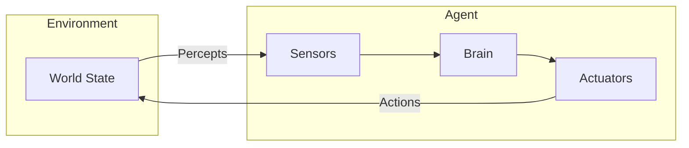

# ¿Qué es un Agente?

## Definición

Un **agente** es cualquier cosa que puede verse como:
1. **Percibiendo** su entorno a través de **sensores**
2. **Actuando** sobre ese entorno a través de **actuadores**



## Ejemplos de Agentes

| Agente | Sensores | Actuadores |
|--------|----------|------------|
| **Humano** | Ojos, oídos, piel | Manos, piernas, voz |
| **Robot** | Cámaras, LIDAR, touch | Motores, grippers |
| **Software** | Archivos, network, input | Display, network, files |
| **Termostato** | Termómetro | Switch on/off |

---

## Agent Function vs Agent Program

Dos conceptos relacionados pero distintos:

| Concepto | Descripción | Naturaleza |
|----------|-------------|------------|
| **Agent Function** | Mapeo de percept sequences a actions | Abstracta, matemática |
| **Agent Program** | Implementación concreta | Código ejecutable |

$$f: \mathcal{P}^* \rightarrow \mathcal{A}$$

Donde $\mathcal{P}^*$ es el conjunto de todas las secuencias posibles de percepts y $\mathcal{A}$ es el conjunto de acciones.

### El Problema de la Tabla

Si intentáramos implementar un agente con una **tabla de lookup**:

```
Percept Sequence → Action
[A, Clean] → Right
[A, Dirty] → Suck
[B, Clean] → Left
[B, Dirty] → Suck
[A, Clean], [A, Clean] → Right
...
```

Para un taxi autónomo con cámara HD a 30fps por 1 hora:
- Entradas posibles: $> 10^{600,000,000,000}$
- Átomos en el universo observable: $< 10^{80}$

**Conclusión**: Necesitamos programas compactos, no tablas.

---

## Visualización: Espectro de Agentes


---

:::exercise{title="Identificando Agentes" difficulty="1"}

Para cada sistema, identifica:
1. ¿Es un agente? ¿Por qué?
2. Si sí, ¿cuáles son sus sensores y actuadores?

Sistemas:
- a) Un reloj de pared
- b) Un termostato programable
- c) Una puerta automática
- d) Google Search
- e) Un virus biológico
- f) Una empresa (como organización)

:::

---

:::exercise{title="Vacuum World" difficulty="2"}

Considera el mundo de la aspiradora con dos cuartos (A y B):

```
┌───┬───┐
│ A │ B │
└───┴───┘
```

Cada cuarto puede estar limpio o sucio. La aspiradora puede:
- Moverse a la izquierda (Left)
- Moverse a la derecha (Right)
- Aspirar (Suck)

1. ¿Cuántos estados posibles tiene el environment?
2. ¿Cuántas percept sequences de longitud 3 existen?
3. Diseña una agent function simple (tabla pequeña) que limpie ambos cuartos.

:::

---

:::prompt{title="Explorar Agentes con LLM" for="Claude/ChatGPT"}

Quiero entender mejor el concepto de agente en IA. 

Dado el siguiente sistema: [DESCRIBE TU SISTEMA]

1. ¿Puede modelarse como un agente? Justifica.
2. Si sí, ¿cuáles serían sus:
   - Sensores (¿qué percibe?)
   - Actuadores (¿qué acciones puede tomar?)
   - Environment (¿en qué mundo opera?)
3. ¿Qué tan complejo es su "agent function"?
4. ¿Qué desafíos tendría implementar este agente?

Dame ejemplos concretos y específicos.

:::

---

## Puntos Clave

1. **Agente = Percepción + Acción** en un environment
2. La **agent function** es el mapeo ideal; el **agent program** es la implementación
3. Las tablas de lookup son **imposibles** para problemas reales
4. El reto de AI es encontrar **programas compactos** que aproximen buenas agent functions

