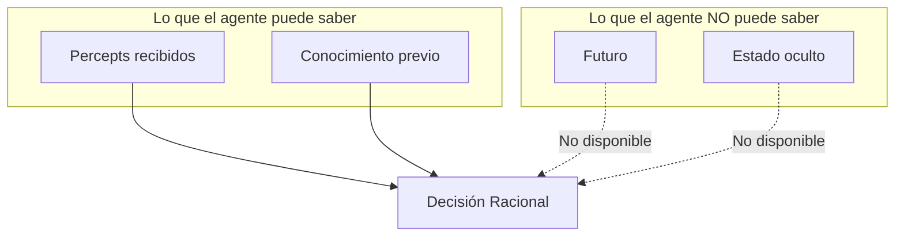
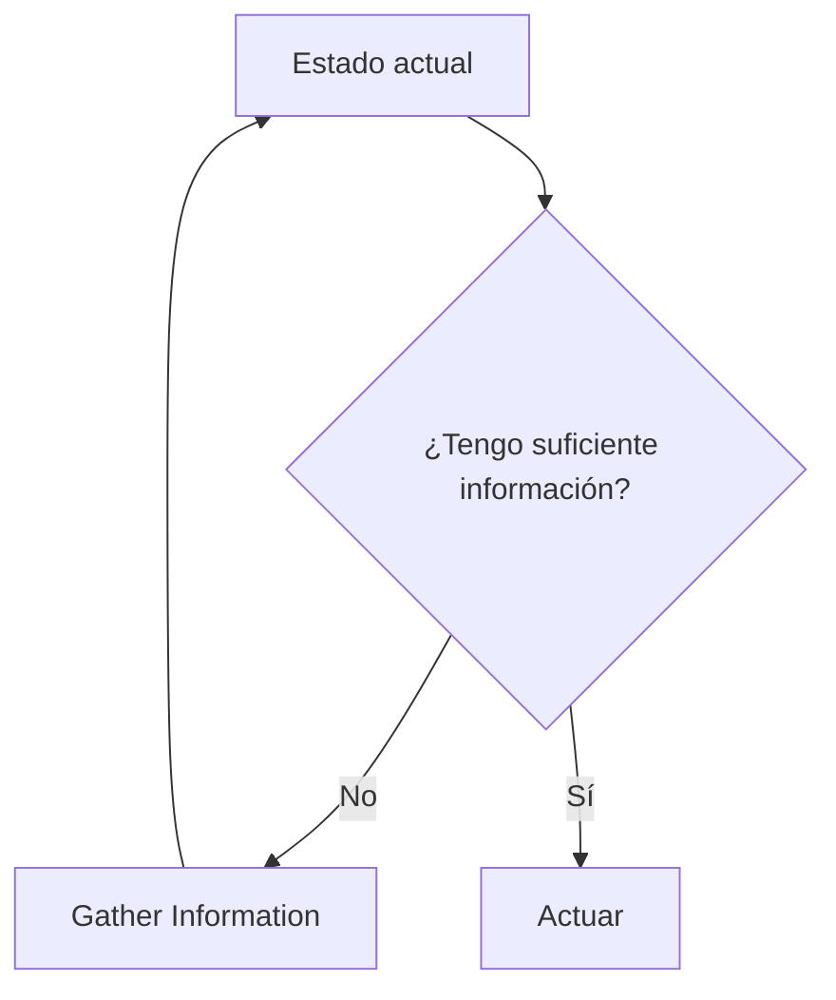

# Racionalidad

## ¿Qué significa actuar racionalmente?

Un **agente racional** es uno que hace "lo correcto". Pero ¿qué es "lo correcto"?

> **Definición**: Un agente racional selecciona acciones que **maximizan su expected performance measure**, dado:
> - El performance measure
> - El conocimiento previo del environment
> - Las acciones disponibles
> - La secuencia de percepts hasta el momento

---

## Performance Measure

El **performance measure** evalúa qué tan bien le va al agente. Es definido por el diseñador.

### Ejemplos

| Agente | Performance Measure |
|--------|---------------------|
| Vacuum robot | Cantidad de suciedad aspirada, energía consumida |
| Taxi autónomo | Seguridad, tiempo, costo, legalidad, comodidad |
| Chess player | Ganar/empatar/perder |
| Trading bot | Retorno ajustado por riesgo |

### ⚠️ Cuidado con el Performance Measure

El agente optimizará **exactamente** lo que le pidas, no lo que quieres.

:::example{title="El Vacuum Malicioso"}

Si el performance measure es "cantidad de suciedad aspirada":
- Un agente racional podría aspirar, tirar la suciedad, y volver a aspirar
- Maximiza el measure, pero no es lo que queremos

**Mejor measure**: Suelo limpio en cada momento.

:::

---

## Racionalidad ≠ Perfección

### Ejemplo: Cruzando la calle

Estás caminando en París. Ves a un amigo al otro lado de la calle. No hay tráfico visible. Empiezas a cruzar.

A 10,000 metros de altura, una puerta de avión se desprende...

**¿Fuiste irracional al cruzar?** No. La racionalidad se mide con la **información disponible**, no con el resultado.

---

## Racionalidad ≠ Omnisciencia

| Concepto | Descripción |
|----------|-------------|
| **Omnisciencia** | Conocer el resultado real de las acciones |
| **Racionalidad** | Maximizar el resultado **esperado** dada la información |

Un agente racional:
- Maximiza **expected** performance
- **No** garantiza el mejor resultado real
- Actúa con la **información disponible**

---

## Information Gathering

Un agente racional no solo actúa, también **busca información** cuando es útil.

**Ejemplo**: Antes de cruzar la calle, un agente racional **mira a ambos lados**.

---

## Autonomía vs Conocimiento Inicial

| Extremo | Descripción | Problema |
|---------|-------------|----------|
| **Todo innato** | El diseñador programa todo | Frágil, no adaptable |
| **Todo aprendido** | El agente aprende desde cero | Muy lento, puede fallar al inicio |

**Balance**: Conocimiento inicial + capacidad de aprender.

:::example{title="El Escarabajo Pelotero"}

El escarabajo tiene comportamiento innato:
1. Cavar nido
2. Buscar bola de estiércol
3. Llevar al nido
4. Entrar a verificar
5. Meter la bola

Si la bola se mueve mientras verifica, **repite desde el paso 2** indefinidamente.

No aprende. No se adapta. Falla ante lo inesperado.

:::

---

:::exercise{title="¿Racional o Irracional?" difficulty="2"}

Para cada escenario, determina si el agente actuó racionalmente:

1. Un robot de limpieza gasta toda su batería limpiando un cuarto mientras otros están sucios.

2. Un carro autónomo frena bruscamente porque un sensor detectó un obstáculo que resultó ser una bolsa de plástico.

3. Un filtro de spam bloquea un email importante de tu jefe porque contenía la palabra "FREE".

4. Un jugador de poker hace all-in con par de ases y pierde contra una escalera de color.

5. Un médico IA recomienda más pruebas antes de diagnosticar, retrasando el tratamiento.

Para cada caso: ¿Qué información tenía el agente? ¿Maximizó expected value dado esa información?

:::

---

:::prompt{title="Diseñando Performance Measures" for="Claude/ChatGPT"}

Estoy diseñando un agente para: [DESCRIBE LA TAREA]

Ayúdame a definir un buen performance measure:

1. ¿Qué comportamientos queremos incentivar?
2. ¿Qué comportamientos queremos evitar?
3. ¿Cómo podría el agente "hackear" un measure mal diseñado?
4. Propón 3 performance measures alternativos con sus pros y contras.
5. ¿Cómo balancearías múltiples objetivos conflictivos?

:::

---

## Puntos Clave

1. **Racionalidad** = Maximizar expected performance dada la información
2. **No es perfección** ni omnisciencia
3. El **performance measure** debe capturar lo que realmente queremos
4. Agentes racionales **buscan información** cuando es útil
5. Balance entre **conocimiento innato** y **capacidad de aprender**

