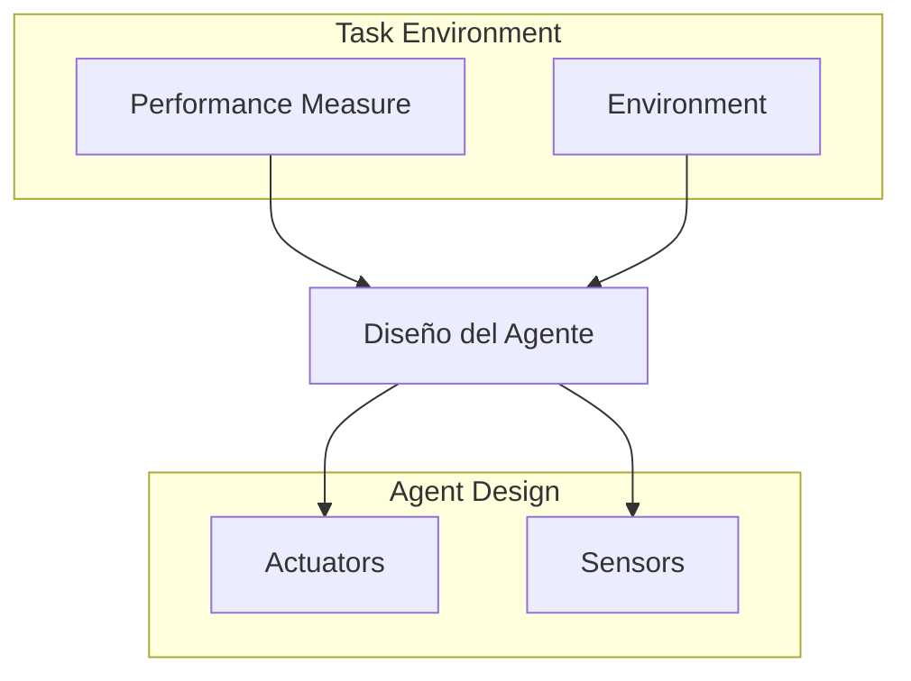

# Framework PEAS

El primer paso para diseñar un agente es especificar su **task environment**.

## Los 4 Componentes

**PEAS** = **P**erformance, **E**nvironment, **A**ctuators, **S**ensors

---

## Ejemplo Detallado: Taxi Autónomo

| Componente | Especificación |
|------------|----------------|
| **Performance** | Seguro, rápido, legal, cómodo, rentable, bajo impacto en otros |
| **Environment** | Calles, tráfico, peatones, clima, pasajeros, policía |
| **Actuators** | Volante, acelerador, freno, señales, bocina, display, voz |
| **Sensors** | Cámaras, radar, LIDAR, GPS, velocímetro, acelerómetro, micrófonos |

### Conflictos en Performance

¿Cómo balancear?
- **Rápido** vs **Seguro**
- **Cómodo** vs **Rápido**
- **Rentable** vs **Legal** (¿tomar atajos?)

---

## Más Ejemplos PEAS

### Sistema de Diagnóstico Médico

| P | E | A | S |
|---|---|---|---|
| Paciente sano, costos reducidos | Paciente, hospital, staff | Mostrar preguntas, tests, diagnósticos, tratamientos | Input de síntomas y resultados |

### Robot que Recoge Partes

| P | E | A | S |
|---|---|---|---|
| % de partes en bins correctos | Banda transportadora, partes, bins | Brazo articulado, gripper | Cámara, sensores táctiles y de posición |

### Tutor de Inglés Interactivo

| P | E | A | S |
|---|---|---|---|
| Score del estudiante en examen | Estudiantes, sistema de testing | Display de ejercicios, feedback, voz | Teclado, voz |

---

## Visualización: Comparando Agentes

---

:::exercise{title="PEAS Analysis" difficulty="2"}

Completa la tabla PEAS para cada agente:

**1. Filtro de Spam**
| P | E | A | S |
|---|---|---|---|
| ? | ? | ? | ? |

**2. Recomendador de Netflix**
| P | E | A | S |
|---|---|---|---|
| ? | ? | ? | ? |

**3. Robot Aspiradora (Roomba)**
| P | E | A | S |
|---|---|---|---|
| ? | ? | ? | ? |

**4. Asistente Virtual (Alexa/Siri)**
| P | E | A | S |
|---|---|---|---|
| ? | ? | ? | ? |

**5. Sistema de Trading Algorítmico**
| P | E | A | S |
|---|---|---|---|
| ? | ? | ? | ? |

:::

---

:::exercise{title="Diseña tu Agente" difficulty="3"}

Elige un problema que te interese y diseña un agente para resolverlo:

1. **Describe el problema** en 2-3 oraciones
2. **Completa PEAS** para tu agente
3. **Identifica conflictos** en el performance measure
4. **Lista 3 desafíos** que enfrentaría tu agente
5. **Propón** cómo evaluarías si tu agente es "bueno"

Problemas sugeridos:
- Agente que gestiona tu calendario
- Agente que optimiza tu consumo de energía en casa
- Agente que modera contenido en redes sociales
- Agente que ayuda a estudiar

:::

---

:::prompt{title="PEAS con LLM" for="Claude/ChatGPT"}

Quiero diseñar un agente inteligente para: [DESCRIBE TU PROBLEMA]

Ayúdame a hacer un análisis PEAS completo:

1. **Performance**: ¿Qué métricas indican éxito? ¿Hay conflictos entre métricas?

2. **Environment**: 
   - ¿Qué entidades existen en el mundo del agente?
   - ¿Qué puede cambiar? ¿Qué es estático?
   - ¿Hay otros agentes?

3. **Actuators**: 
   - ¿Qué acciones puede tomar?
   - ¿Son discretas o continuas?
   - ¿Tienen efectos determinísticos?

4. **Sensors**:
   - ¿Qué puede percibir?
   - ¿La percepción es perfecta o ruidosa?
   - ¿Qué información está oculta?

Sé específico y concreto.

:::

---

## Por Qué PEAS es Importante

1. **Clarifica el problema** antes de diseñar soluciones
2. **Identifica restricciones** reales
3. **Revela trade-offs** entre objetivos
4. **Guía la evaluación** del agente
5. **Facilita comunicación** entre diseñadores

> "Si no puedes especificar PEAS claramente, no entiendes tu problema."

---

## Puntos Clave

1. **PEAS** es el framework para especificar task environments
2. **Performance** define qué es "éxito" (cuidado con los trade-offs)
3. **Environment** es todo lo que afecta y es afectado por el agente
4. **Actuators** y **Sensors** son la interfaz con el mundo
5. Especificar PEAS es el **primer paso** del diseño

