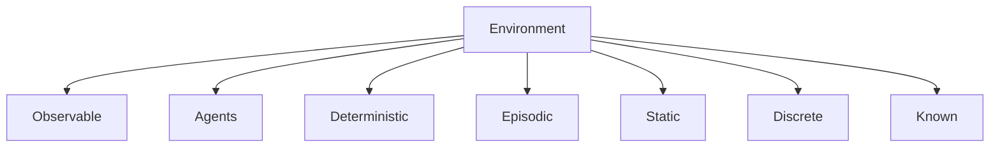

# Propiedades del Environment

Las características del environment determinan qué tipo de agente necesitamos.

## Las 7 Dimensiones

---

## 1. Observable: Fully vs Partially

| Tipo | Descripción | Implicación |
|------|-------------|-------------|
| **Fully Observable** | El agente ve todo el estado relevante | No necesita memoria interna |
| **Partially Observable** | Parte del estado está oculta | Necesita inferir estado oculto |
| **Unobservable** | Sin sensores | Debe actuar "a ciegas" |

**Ejemplos**:
- Ajedrez: Fully observable
- Poker: Partially (cartas ocultas)
- Robot en cuarto oscuro: Partially

---

## 2. Agents: Single vs Multi

| Tipo | Descripción | Complejidad |
|------|-------------|-------------|
| **Single Agent** | Solo el agente actúa | Más simple |
| **Multi-Agent Competitive** | Otros optimizan contra ti | Game theory |
| **Multi-Agent Cooperative** | Otros ayudan | Coordinación |

**Pregunta clave**: ¿El comportamiento de B se modela mejor como agente o como "física"?

---

## 3. Deterministic vs Stochastic

| Tipo | Descripción | Ejemplo |
|------|-------------|---------|
| **Deterministic** | Mismo estado + acción = mismo resultado | Ajedrez |
| **Stochastic** | Probabilidades explícitas | Backgammon |
| **Nondeterministic** | Incertidumbre sin probabilidades | Parcialmente observable aparenta esto |

---

## 4. Episodic vs Sequential

| Tipo | Descripción | Implicación |
|------|-------------|-------------|
| **Episodic** | Cada decisión es independiente | No necesita planear |
| **Sequential** | Decisiones afectan el futuro | Debe considerar consecuencias |

**Ejemplos**:
- Clasificar spam: Episodic
- Ajedrez: Sequential
- Diagnóstico médico: Sequential (tests afectan diagnóstico)

---

## 5. Static vs Dynamic

| Tipo | Descripción | Implicación |
|------|-------------|-------------|
| **Static** | El mundo no cambia mientras piensas | Puedes deliberar |
| **Dynamic** | El mundo cambia | "No decidir" es una decisión |
| **Semi-dynamic** | Estado no cambia, pero score sí | Ajedrez con reloj |

---

## 6. Discrete vs Continuous

Aplica a: **estados**, **tiempo**, **percepts**, **acciones**

| Tipo | Ejemplo |
|------|---------|
| **Discrete** | Ajedrez (finitos estados, movimientos discretos) |
| **Continuous** | Conducir (posición, velocidad, ángulo continuos) |

---

## 7. Known vs Unknown

| Tipo | Descripción | Nota |
|------|-------------|------|
| **Known** | Las "reglas del juego" son conocidas | No es lo mismo que observable |
| **Unknown** | Debe descubrir cómo funciona el mundo | Requiere exploración |

**Ejemplo**: Solitario es known pero partially observable (conoces reglas, no las cartas).

---

## Tabla de Clasificación

| Environment | Obs | Agents | Det | Epis | Static | Disc |
|-------------|-----|--------|-----|------|--------|------|
| Crucigrama | Full | Single | Det | Seq | Static | Disc |
| Ajedrez con reloj | Full | Multi | Det | Seq | Semi | Disc |
| Poker | Partial | Multi | Stoch | Seq | Static | Disc |
| Backgammon | Full | Multi | Stoch | Seq | Static | Disc |
| **Taxi** | Partial | Multi | Stoch | Seq | Dynamic | Cont |
| Diagnóstico médico | Partial | Single | Stoch | Seq | Dynamic | Cont |

---

## El Caso Más Difícil

**Taxi autónomo**:
- ✗ Partially observable (no ves todo)
- ✗ Multi-agent (otros carros, peatones)
- ✗ Stochastic (acciones inciertas)
- ✗ Sequential (decisiones tienen consecuencias)
- ✗ Dynamic (mundo cambia constantemente)
- ✗ Continuous (estados y acciones)
- ✓ Mostly known (conocemos física, leyes)

---

:::exercise{title="Clasifica estos Environments" difficulty="2"}

Clasifica cada environment en las 7 dimensiones:

| Environment | Obs | Agents | Det | Epis | Static | Disc | Known |
|-------------|-----|--------|-----|------|--------|------|-------|
| 1. Sudoku | | | | | | | |
| 2. League of Legends | | | | | | | |
| 3. Roomba (robot aspiradora) | | | | | | | |
| 4. ChatGPT respondiendo | | | | | | | |
| 5. Spotify recomendando | | | | | | | |
| 6. Mercado de valores | | | | | | | |

:::

---

:::exercise{title="Impacto en el Diseño" difficulty="3"}

Para cada propiedad, explica:
1. ¿Cómo afecta al diseño del agente?
2. ¿Qué técnicas se necesitan para manejarlo?

Propiedades a analizar:
- Partially observable → ¿Qué necesita el agente?
- Multi-agent competitive → ¿Cómo cambia la estrategia?
- Stochastic → ¿Qué debe maximizar?
- Sequential → ¿Qué debe considerar?
- Dynamic → ¿Qué restricciones impone?

:::

---

:::prompt{title="Analizando Environments" for="Claude/ChatGPT"}

Estoy analizando el siguiente environment: [DESCRIBE EL ENVIRONMENT]

Para cada una de las 7 dimensiones (Observable, Agents, Deterministic, Episodic, Static, Discrete, Known):

1. Clasifica el environment
2. Justifica tu clasificación con ejemplos concretos
3. Explica cómo esta propiedad afecta el diseño del agente
4. Sugiere técnicas de IA apropiadas para manejar esta propiedad

Al final, indica qué tan "difícil" es este environment comparado con otros.

:::

---

## Puntos Clave

1. Las **7 dimensiones** caracterizan cualquier task environment
2. Cada dimensión afecta qué **técnicas** son apropiadas
3. Environments más complejos requieren agentes más sofisticados
4. **Known ≠ Observable** (puedes conocer las reglas sin ver todo)
5. El "peor caso" es: partially, multi, stochastic, sequential, dynamic, continuous, unknown

