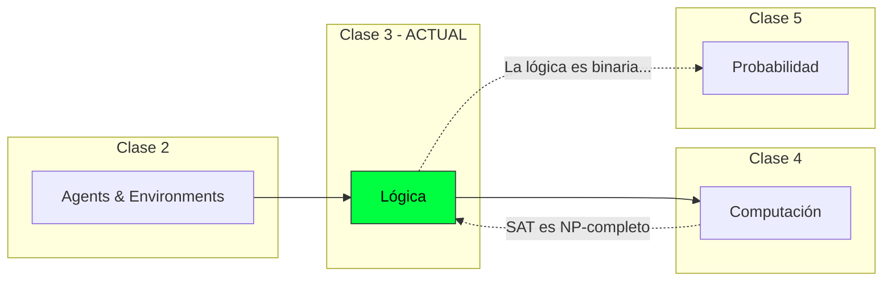

# Lógica: Razonamiento con Certeza

La base del razonamiento formal en agentes inteligentes.

## Contenido del Módulo

| Sección | Tema |
|---------|------|
| 3.1 | Introducción: ¿Por qué Lógica? |
| 3.2 | Lógica Proposicional |
| 3.3 | Inferencia y Demostración |
| 3.4 | Satisfacibilidad y SAT |
| 3.5 | Agentes Basados en Conocimiento: Wumpus World |

## Objetivos

Al terminar este módulo podrás:

- Entender por qué la lógica es fundamental para agentes que razonan
- Dominar la sintaxis y semántica de la lógica proposicional
- Aplicar reglas de inferencia (Modus Ponens, Resolución, etc.)
- Distinguir entre validez, satisfacibilidad e insatisfacibilidad
- Formalizar problemas del mundo real en lógica proposicional
- Comprender las limitaciones computacionales (SAT es NP-completo)
- Diseñar un agente basado en conocimiento para el Wumpus World

## Marco del Agente

En este módulo, el agente es un **agente basado en conocimiento** que:

| Aspecto | Descripción |
|---------|-------------|
| **Agente** | Razonador lógico que deriva conclusiones de hechos |
| **Environment** | Fully observable, determinista (ideal para lógica) |
| **Objetivo** | Derivar conclusiones verdaderas a partir de conocimiento |
| **Limitación clave** | La lógica es binaria (verdadero/falso) — no maneja incertidumbre |

## Conexión con el Curso

La lógica es el primer paso hacia el razonamiento formal:
- **Clase 2** estableció qué es un agente
- **Clase 3** (esta) enseña a razonar con certeza
- **Clase 4** mostrará los límites computacionales (SAT ∈ NP-completo)
- **Clase 5** extenderá la lógica para manejar incertidumbre

## Lecturas

Ver [Anexo: Lecturas](./a_lecturas.md) para el PDF completo.

| Libro | Capítulos | Páginas |
|-------|-----------|---------|
| **Artificial Intelligence: A Modern Approach** | Ch 7: Logical Agents | 210-253 |

## Nota Histórica

> *"La lógica es el comienzo de la sabiduría, no su fin."*
> — Spock, Star Trek VI

La lógica formal tiene más de 2000 años, desde Aristóteles. En IA, el enfoque **logicista** dominó los años 70-80 con los sistemas expertos. Aunque hoy usamos métodos probabilísticos, la lógica sigue siendo fundamental para:
- Verificación de hardware/software
- Planificación automática
- Razonamiento formal en IA simbólica
- SAT solvers modernos (usados en miles de aplicaciones)
