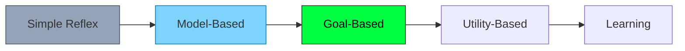
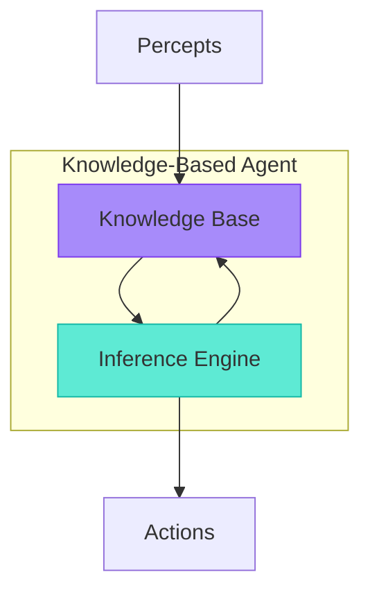
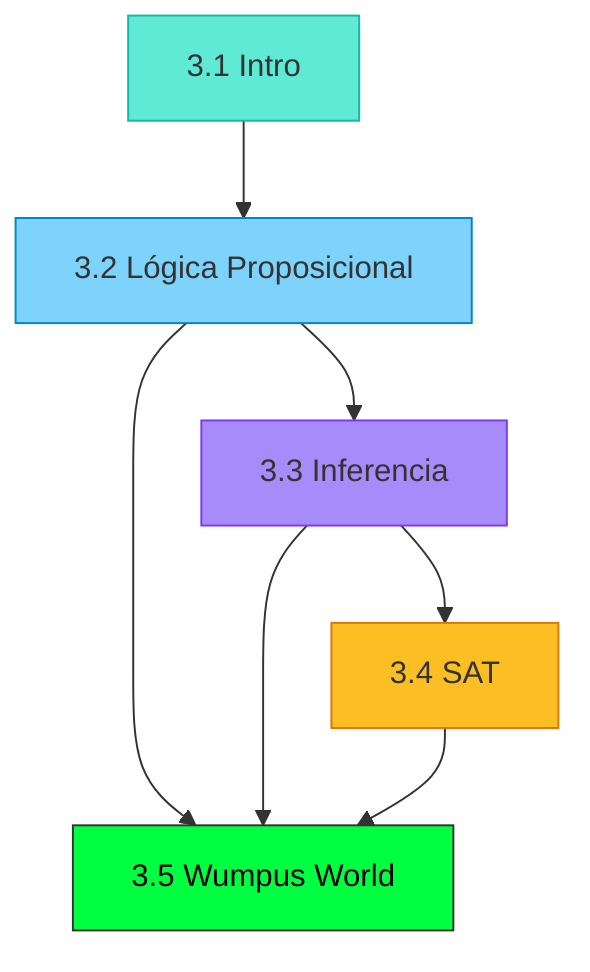

# Introducción: ¿Por qué Lógica?

## De Reflex a Razonamiento

En la clase anterior vimos diferentes arquitecturas de agentes:



Los **Simple Reflex Agents** actúan por reglas fijas:
```
if percept == "dirty" then Suck
```

Pero ¿qué pasa cuando el agente necesita **razonar** sobre situaciones que nunca ha visto? ¿Cómo puede derivar **nuevas conclusiones** de lo que sabe?

La respuesta: **Lógica**.

---

## El Problema Fundamental

Imagina un agente en una cueva peligrosa (el famoso **Wumpus World**):


El agente percibe:
- Brisa en [1,2] → Hay un pozo adyacente
- No hay brisa en [1,1] → No hay pozos adyacentes a [1,1]

**Pregunta**: ¿Es seguro moverse a [2,2]?

Un **Simple Reflex Agent** no puede responder esto — no tiene una regla para cada combinación posible de percepts.

Un **Knowledge-Based Agent** puede:
1. **Representar** lo que sabe en un lenguaje formal
2. **Inferir** nuevos hechos de lo que sabe
3. **Decidir** basándose en sus inferencias

---

## ¿Qué es un Agente Basado en Conocimiento?

Un **Knowledge-Based Agent** tiene dos componentes principales:



| Componente | Descripción | Analogía |
|------------|-------------|----------|
| **Knowledge Base (KB)** | Conjunto de hechos conocidos | "Lo que sé" |
| **Inference Engine** | Mecanismo para derivar nuevos hechos | "Cómo razono" |

### El Ciclo del Agente

```
function KB-AGENT(percept):
    TELL(KB, MAKE-PERCEPT-SENTENCE(percept, t))
    action ← ASK(KB, MAKE-ACTION-QUERY(t))
    TELL(KB, MAKE-ACTION-SENTENCE(action, t))
    t ← t + 1
    return action
```

**TELL**: Añade conocimiento a la KB
**ASK**: Consulta si algo se puede inferir de la KB

---

## ¿Por Qué un Lenguaje Formal?

El conocimiento debe representarse en un **lenguaje formal** por varias razones:

| Razón | Explicación |
|-------|-------------|
| **Precisión** | Sin ambigüedad del lenguaje natural |
| **Mecanizable** | Las computadoras pueden procesarlo |
| **Verificable** | Podemos probar propiedades |
| **Composicional** | El significado de expresiones complejas deriva de sus partes |

### Ejemplo: Ambigüedad del Lenguaje Natural

"Vi al hombre con el telescopio"
- ¿Usé un telescopio para verlo?
- ¿El hombre tenía un telescopio?

En lógica formal:
- $Saw(I, Man) \land Used(I, Telescope)$
- $Saw(I, Man) \land Has(Man, Telescope)$

**No hay ambigüedad.**

---

## El Enfoque "Thinking Rationally"

Recuerda los 4 enfoques de la IA (Clase 2):

|  | **Humanamente** | **Racionalmente** |
|--|-----------------|-------------------|
| **Pensar** | Ciencia Cognitiva | **Leyes del Pensamiento** |
| **Actuar** | Test de Turing | Agentes Racionales |

La lógica es el corazón de **"Thinking Rationally"** — las **Leyes del Pensamiento**.

### Las Leyes del Pensamiento (Aristóteles)

Aristóteles identificó patrones de razonamiento **siempre válidos**:

**Silogismo:**
```
Todos los hombres son mortales.
Sócrates es hombre.
∴ Sócrates es mortal.
```

Si las premisas son verdaderas, la conclusión **debe** ser verdadera.

---

## Tipos de Lógica

La lógica viene en diferentes "sabores":

| Tipo | Qué Representa | Ejemplo | Complejidad |
|------|----------------|---------|-------------|
| **Proposicional** | Hechos verdadero/falso | "Está lloviendo" | Decidible (NP) |
| **Primer Orden (FOL)** | Objetos, relaciones, cuantificadores | "Todos los humanos son mortales" | Semi-decidible |
| **Temporal** | Cambios en el tiempo | "Eventualmente llegará" | Varía |
| **Modal** | Necesidad, posibilidad | "Necesariamente P" | Varía |
| **Probabilística** | Grados de creencia | "Probablemente P" | Clase 5 |

En este módulo nos enfocamos en **Lógica Proposicional** — la más simple, pero fundamental.

---

## Ventajas y Limitaciones de la Lógica

### ✓ Ventajas

| Ventaja | Descripción |
|---------|-------------|
| **Precisión** | No hay ambigüedad |
| **Soundness** | Solo deriva conclusiones verdaderas |
| **Completeness** | Puede derivar todo lo que es verdad |
| **Composicionalidad** | Significado de partes → significado del todo |
| **Herramientas** | SAT solvers muy optimizados |

### ✗ Limitaciones

| Limitación | Descripción | Solución |
|------------|-------------|----------|
| **Binaria** | Solo verdadero/falso, no "probable" | Probabilidad (Clase 5) |
| **Computacional** | SAT es NP-completo | Heurísticas, SAT solvers |
| **Conocimiento completo** | Asume que sabemos todo lo relevante | Lógica no-monótona |
| **Estática** | No captura cambios fácilmente | Lógica temporal |

---

## Mapa del Módulo



| Sección | Pregunta que Responde |
|---------|----------------------|
| **3.2 Lógica Proposicional** | ¿Cómo represento conocimiento? |
| **3.3 Inferencia** | ¿Cómo derivo nuevas conclusiones? |
| **3.4 SAT** | ¿Qué puedo computar? |
| **3.5 Wumpus World** | ¿Cómo aplico todo junto? |

---

## Preguntas para Reflexionar

Antes de continuar, piensa:

1. ¿Cómo razonas tú cuando juegas Minesweeper?
2. ¿Qué diferencia hay entre "saber" algo y "poder demostrarlo"?
3. Si solo puedes representar verdadero/falso, ¿cómo manejas "no sé"?
4. ¿Por qué crees que los sistemas expertos de los 80s usaban lógica?

---

:::exercise{title="Razonamiento Informal" difficulty="1"}

Sin usar lógica formal, razona sobre este problema:

**Situación:**
- Si llueve, la calle se moja.
- La calle está mojada.

**Pregunta:** ¿Podemos concluir que llovió?

**Análisis:**
1. ¿Es válida esta conclusión?
2. ¿Qué otras explicaciones hay para que la calle esté mojada?
3. ¿Cómo formalizarías este razonamiento?

:::

<details>
<summary><strong>Ver Análisis</strong></summary>

**Respuesta:** No, no podemos concluir que llovió.

Este es un error lógico llamado **Afirmación del Consecuente**:
- Premisa 1: Si P entonces Q (Si llueve → calle mojada)
- Premisa 2: Q (calle mojada)
- Conclusión incorrecta: P (llovió)

**Otras explicaciones:**
- Alguien lavó su carro
- Se rompió una tubería
- Pasó un camión de riego

**Formalización:**
- $Llueve \rightarrow CalleMojada$ ✓
- $CalleMojada$ ✓
- $Llueve$ ✗ (no se puede derivar)

Lo que sí sería válido:
- Si llueve → calle mojada
- Llovió
- ∴ Calle mojada (**Modus Ponens** — veremos en 3.3)

</details>

---

## Puntos Clave

1. Los **Simple Reflex Agents** no pueden razonar sobre situaciones nuevas
2. Los **Knowledge-Based Agents** representan conocimiento y derivan conclusiones
3. La lógica proporciona un **lenguaje formal** sin ambigüedad
4. El enfoque **"Thinking Rationally"** usa las leyes del pensamiento (lógica)
5. La lógica proposicional es simple pero tiene **limitaciones** (binaria, NP-completo)
6. Este módulo cubre: sintaxis, semántica, inferencia, SAT, y aplicación
