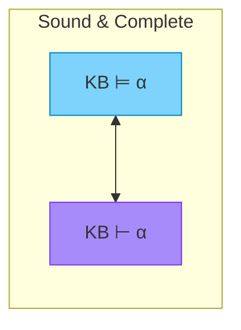
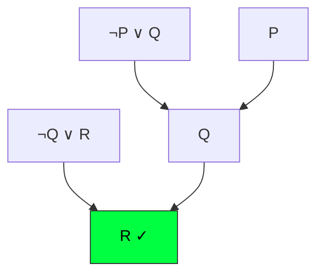
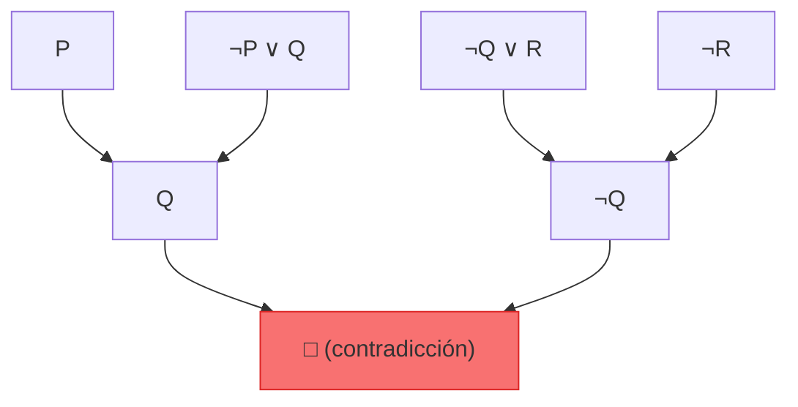

# Inferencia y Demostración

Derivando nuevo conocimiento a partir de lo que sabemos.

## Consecuencia Lógica (Entailment)

El concepto central de la lógica es **entailment** (consecuencia lógica):

$$\alpha \models \beta$$

"$\alpha$ **implica** $\beta$" significa: En **todo modelo** donde $\alpha$ es verdadera, $\beta$ también es verdadera.

### Definición Formal

$$\alpha \models \beta \text{ si y solo si } M(\alpha) \subseteq M(\beta)$$

Donde $M(\alpha)$ es el conjunto de modelos que satisfacen $\alpha$.


### Ejemplo

Sea $KB = (P \land Q)$

¿$KB \models P$?

- Modelos donde $KB$ es verdadera: $\{P=T, Q=T\}$ (solo uno)
- En ese modelo, ¿$P$ es verdadera? ¡Sí!
- Por lo tanto: $KB \models P$ ✓

---

## Inferencia vs Entailment

| Concepto | Símbolo | Significado |
|----------|---------|-------------|
| **Entailment** | $\models$ | Relación semántica (verdad) |
| **Inferencia** | $\vdash$ | Proceso sintáctico (derivación) |

Un **algoritmo de inferencia** $i$ deriva $\alpha \vdash_i \beta$.

### Propiedades Deseables

| Propiedad | Definición | Importancia |
|-----------|------------|-------------|
| **Soundness** (Correctitud) | Si $\alpha \vdash_i \beta$ entonces $\alpha \models \beta$ | No deriva falsedades |
| **Completeness** (Completitud) | Si $\alpha \models \beta$ entonces $\alpha \vdash_i \beta$ | Deriva todo lo verdadero |

**Ideal:** Un algoritmo que sea **sound** y **complete**.



---

## Reglas de Inferencia

Las **reglas de inferencia** son patrones de derivación que preservan la verdad.

### Modus Ponens

La regla más fundamental:

$$\frac{\alpha \rightarrow \beta, \quad \alpha}{\beta}$$

"Si tenemos $\alpha \rightarrow \beta$ y $\alpha$, podemos derivar $\beta$"

:::example{title="Modus Ponens"}

**KB:**
1. $Llueve \rightarrow CalleMojada$
2. $Llueve$

**Derivación:**
Por Modus Ponens: $CalleMojada$ ✓

:::

### Modus Tollens

$$\frac{\alpha \rightarrow \beta, \quad \neg\beta}{\neg\alpha}$$

"Si $\alpha$ implica $\beta$, y $\beta$ es falso, entonces $\alpha$ es falso"

:::example{title="Modus Tollens"}

**KB:**
1. $Llueve \rightarrow CalleMojada$
2. $\neg CalleMojada$

**Derivación:**
Por Modus Tollens: $\neg Llueve$ ✓

:::

### Eliminación de AND

$$\frac{\alpha \land \beta}{\alpha}$$

$$\frac{\alpha \land \beta}{\beta}$$

### Introducción de AND

$$\frac{\alpha, \quad \beta}{\alpha \land \beta}$$

### Introducción de OR

$$\frac{\alpha}{\alpha \lor \beta}$$

### Silogismo Hipotético

$$\frac{\alpha \rightarrow \beta, \quad \beta \rightarrow \gamma}{\alpha \rightarrow \gamma}$$

### Silogismo Disyuntivo

$$\frac{\alpha \lor \beta, \quad \neg\alpha}{\beta}$$

---

## Inferencia por Enumeración de Modelos

El método más simple (pero costoso) para verificar $KB \models \alpha$:

```python
def tt_entails(kb, alpha):
    """
    Verifica si KB ⊨ alpha por enumeración de modelos.
    """
    symbols = get_all_symbols(kb, alpha)
    return tt_check_all(kb, alpha, symbols, {})

def tt_check_all(kb, alpha, symbols, model):
    if not symbols:  # Modelo completo
        if evaluate(kb, model):  # Si KB es verdadera
            return evaluate(alpha, model)  # alpha debe ser verdadera
        else:
            return True  # KB falsa → implicación vacuamente verdadera
    else:
        p = symbols[0]
        rest = symbols[1:]
        return (tt_check_all(kb, alpha, rest, {**model, p: True}) and
                tt_check_all(kb, alpha, rest, {**model, p: False}))
```

### Complejidad

- **Tiempo:** $O(2^n)$ donde $n$ = número de símbolos
- **Espacio:** $O(n)$ (profundidad de recursión)

**Problema:** Exponencial — no escala para problemas grandes.

---

## Resolución

La **resolución** es una regla de inferencia particularmente poderosa.

### Regla de Resolución (para cláusulas)

$$\frac{l_1 \lor \cdots \lor l_k, \quad m_1 \lor \cdots \lor m_n}{l_1 \lor \cdots \lor l_{i-1} \lor l_{i+1} \lor \cdots \lor l_k \lor m_1 \lor \cdots \lor m_{j-1} \lor m_{j+1} \lor \cdots \lor m_n}$$

Donde $l_i$ y $m_j$ son **complementarios** ($l_i = \neg m_j$).

### Ejemplo Simple

$$\frac{P \lor Q, \quad \neg P \lor R}{Q \lor R}$$

"Resolvemos" sobre $P$ y $\neg P$.

### Ejemplo: Derivación por Resolución

**KB:**
1. $\neg P \lor Q$ (equivalente a $P \rightarrow Q$)
2. $\neg Q \lor R$ (equivalente a $Q \rightarrow R$)
3. $P$

**Objetivo:** Demostrar $R$

**Derivación:**
- Resolver (1) y (3) sobre $P$: $Q$
- Resolver (2) y $Q$ sobre $Q$: $R$ ✓



---

## Refutación por Resolución

Para demostrar $KB \models \alpha$:

1. Añadir $\neg\alpha$ a la KB
2. Convertir todo a CNF
3. Aplicar resolución repetidamente
4. Si derivamos la **cláusula vacía** ($\square$), entonces $KB \models \alpha$

### ¿Por qué funciona?

$$KB \models \alpha \iff KB \land \neg\alpha \text{ es insatisfacible}$$

Si $KB \land \neg\alpha$ es insatisfacible, eventualmente derivamos una contradicción.

:::example{title="Refutación por Resolución"}

**KB:**
1. $A \rightarrow B$
2. $B \rightarrow C$
3. $A$

**Demostrar:** $C$

**Paso 1:** Añadir $\neg C$

**Paso 2:** Convertir a CNF:
1. $\neg A \lor B$
2. $\neg B \lor C$
3. $A$
4. $\neg C$

**Paso 3:** Resolución:
- Resolver (2) y (4): $\neg B$
- Resolver (1) y (3): $B$
- Resolver $\neg B$ y $B$: $\square$ (cláusula vacía)

**Conclusión:** $KB \models C$ ✓

:::

### Algoritmo de Resolución

```python
def pl_resolution(kb, alpha):
    """
    Verifica si KB ⊨ alpha usando resolución.
    """
    clauses = to_cnf(kb) + to_cnf(Not(alpha))
    new = set()
    
    while True:
        for (ci, cj) in all_pairs(clauses):
            resolvents = pl_resolve(ci, cj)
            if EMPTY_CLAUSE in resolvents:
                return True  # KB ⊨ alpha
            new = new.union(resolvents)
        
        if new.issubset(clauses):
            return False  # KB ⊭ alpha
        
        clauses = clauses.union(new)
```

### Completitud de Resolución

**Teorema:** Resolución es **sound** y **complete** para lógica proposicional.

- Sound: Nunca deriva algo falso
- Complete: Si $KB \models \alpha$, la resolución lo encontrará

---

## Forward y Backward Chaining

Para bases de conocimiento con **cláusulas de Horn**, hay algoritmos más eficientes.

### Forward Chaining (Encadenamiento hacia adelante)

**Idea:** Partir de los hechos conocidos, aplicar reglas para derivar nuevos hechos.

```python
def forward_chain(kb, q):
    """
    Determina si q puede derivarse de KB usando forward chaining.
    """
    count = {clause: len(clause.premise) for clause in kb.rules}
    inferred = {symbol: False for symbol in kb.symbols}
    agenda = list(kb.facts)  # Hechos iniciales
    
    while agenda:
        p = agenda.pop()
        if p == q:
            return True
        if not inferred[p]:
            inferred[p] = True
            for clause in kb.rules_with_p_in_premise(p):
                count[clause] -= 1
                if count[clause] == 0:
                    agenda.append(clause.conclusion)
    
    return False
```

**Complejidad:** $O(n)$ donde $n$ = tamaño de KB


:::example{title="Forward Chaining"}

**KB (cláusulas de Horn):**
1. $A$ (hecho)
2. $B$ (hecho)
3. $A \land B \rightarrow C$
4. $C \rightarrow D$

**Consulta:** ¿$D$?

**Proceso:**
- Agenda inicial: [A, B]
- Procesar A: marca A como inferido
- Procesar B: marca B como inferido, regla 3 tiene premisas completas → añadir C
- Procesar C: regla 4 tiene premisa completa → añadir D
- Procesar D: ¡encontrado! ✓

:::

### Backward Chaining (Encadenamiento hacia atrás)

**Idea:** Partir del objetivo, buscar reglas que lo deriven, recursivamente demostrar premisas.

```python
def backward_chain(kb, q, goals=None):
    """
    Determina si q puede derivarse de KB usando backward chaining.
    """
    if goals is None:
        goals = set()
    
    if q in kb.facts:
        return True
    if q in goals:  # Evitar ciclos
        return False
    
    goals.add(q)
    
    for rule in kb.rules_with_conclusion(q):
        if all(backward_chain(kb, premise, goals) for premise in rule.premises):
            return True
    
    return False
```


:::example{title="Backward Chaining"}

**KB:**
1. $A$ (hecho)
2. $B$ (hecho)
3. $A \land B \rightarrow C$
4. $C \rightarrow D$

**Consulta:** ¿$D$?

**Proceso:**
- Objetivo: D
- ¿Cómo derivar D? Regla 4: necesito C
- Objetivo: C
- ¿Cómo derivar C? Regla 3: necesito A y B
- Objetivo: A → ¡es un hecho! ✓
- Objetivo: B → ¡es un hecho! ✓
- C derivado ✓
- D derivado ✓

:::

### Comparación

| Aspecto | Forward | Backward |
|---------|---------|----------|
| **Dirección** | Datos → Objetivo | Objetivo → Datos |
| **Uso** | Monitoreo, derivar todo | Consultas específicas |
| **Eficiencia** | Puede derivar cosas inútiles | Solo deriva lo necesario |
| **Análogo** | Programación declarativa | Prolog |

---

## Ejercicios

:::exercise{title="Modus Ponens y Tollens" difficulty="1"}

Dada la KB:
1. $Estudia \rightarrow Aprueba$
2. $Aprueba \rightarrow Feliz$
3. $\neg Feliz$

¿Qué puedes derivar usando Modus Ponens y/o Modus Tollens?

:::

<details>
<summary><strong>Ver Solución</strong></summary>

**Derivaciones:**

1. De (2) $Aprueba \rightarrow Feliz$ y (3) $\neg Feliz$:
   - Por **Modus Tollens**: $\neg Aprueba$

2. De (1) $Estudia \rightarrow Aprueba$ y $\neg Aprueba$:
   - Por **Modus Tollens**: $\neg Estudia$

**Conclusiones:**
- $\neg Feliz$ (dado)
- $\neg Aprueba$ (derivado)
- $\neg Estudia$ (derivado)

</details>

---

:::exercise{title="Resolución Paso a Paso" difficulty="2"}

Usa resolución para demostrar que la siguiente KB implica $R$:

1. $P$
2. $\neg P \lor Q$
3. $\neg Q \lor R$

:::

<details>
<summary><strong>Ver Solución</strong></summary>

**Paso 1:** Añadir $\neg R$ (negación del objetivo)

Cláusulas:
1. $P$
2. $\neg P \lor Q$
3. $\neg Q \lor R$
4. $\neg R$

**Paso 2:** Aplicar resolución

- Resolver (1) y (2) sobre $P$: **$Q$** (cláusula 5)
- Resolver (3) y (4) sobre $R$: **$\neg Q$** (cláusula 6)
- Resolver (5) y (6) sobre $Q$: **$\square$** (cláusula vacía)

**Conclusión:** Derivamos la cláusula vacía, por lo tanto $KB \models R$ ✓



</details>

---

:::exercise{title="Forward Chaining" difficulty="2"}

Traza forward chaining para la siguiente KB:

**Hechos:** $A, B$

**Reglas:**
- $R1: A \land B \rightarrow C$
- $R2: C \rightarrow D$
- $R3: A \land D \rightarrow E$
- $R4: B \land E \rightarrow F$

¿Qué símbolos se derivan?

:::

<details>
<summary><strong>Ver Solución</strong></summary>

**Estado inicial:**
- Inferidos: {}
- Agenda: [A, B]
- Contadores: R1=2, R2=1, R3=2, R4=2

**Iteración 1 (procesar A):**
- Inferidos: {A}
- R1: contador 2→1
- R3: contador 2→1
- Agenda: [B]

**Iteración 2 (procesar B):**
- Inferidos: {A, B}
- R1: contador 1→0 → añadir **C**
- R4: contador 2→1
- Agenda: [C]

**Iteración 3 (procesar C):**
- Inferidos: {A, B, C}
- R2: contador 1→0 → añadir **D**
- Agenda: [D]

**Iteración 4 (procesar D):**
- Inferidos: {A, B, C, D}
- R3: contador 1→0 → añadir **E**
- Agenda: [E]

**Iteración 5 (procesar E):**
- Inferidos: {A, B, C, D, E}
- R4: contador 1→0 → añadir **F**
- Agenda: [F]

**Iteración 6 (procesar F):**
- Inferidos: {A, B, C, D, E, F}
- Agenda: []

**Resultado:** Se derivan: $A, B, C, D, E, F$

</details>

---

:::exercise{title="Refutación" difficulty="3"}

Usa refutación por resolución para demostrar:

$$\{P \rightarrow Q, Q \rightarrow R, \neg R\} \models \neg P$$

:::

<details>
<summary><strong>Ver Solución</strong></summary>

**Paso 1:** Añadir $\neg(\neg P) = P$

**Paso 2:** Convertir a CNF:
1. $\neg P \lor Q$ (de $P \rightarrow Q$)
2. $\neg Q \lor R$ (de $Q \rightarrow R$)
3. $\neg R$
4. $P$ (negación del objetivo)

**Paso 3:** Resolución:
- Resolver (1) y (4) sobre $P$: **$Q$** (cláusula 5)
- Resolver (2) y (3) sobre $R$: **$\neg Q$** (cláusula 6)
- Resolver (5) y (6) sobre $Q$: **$\square$**

**Conclusión:** $\square$ derivada → KB $\models \neg P$ ✓

</details>

---

:::prompt{title="Practicar Inferencia" for="Claude/ChatGPT"}

Quiero practicar inferencia en lógica proposicional. Dame:

1. 3 ejercicios de aplicar Modus Ponens y Modus Tollens
2. 2 ejercicios de resolución (derivar cláusula vacía)
3. 1 ejercicio de forward chaining con al menos 5 reglas

Para cada ejercicio, espera mi respuesta antes de dar la solución.
Corrige mis errores paso a paso.

:::

---

## Puntos Clave

1. **Entailment** ($\models$) = verdad en todos los modelos
2. **Soundness** = no deriva falsedades; **Completeness** = deriva todo lo verdadero
3. **Modus Ponens**: Si $P \rightarrow Q$ y $P$, entonces $Q$
4. **Modus Tollens**: Si $P \rightarrow Q$ y $\neg Q$, entonces $\neg P$
5. **Resolución** es sound y complete para lógica proposicional
6. **Refutación**: Para probar $KB \models \alpha$, demostrar $KB \land \neg\alpha$ insatisfacible
7. **Forward/Backward chaining** son eficientes para cláusulas de Horn ($O(n)$)
8. **Forward**: datos→objetivo; **Backward**: objetivo→datos
