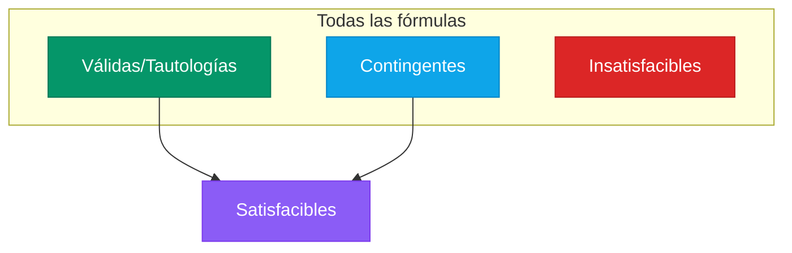
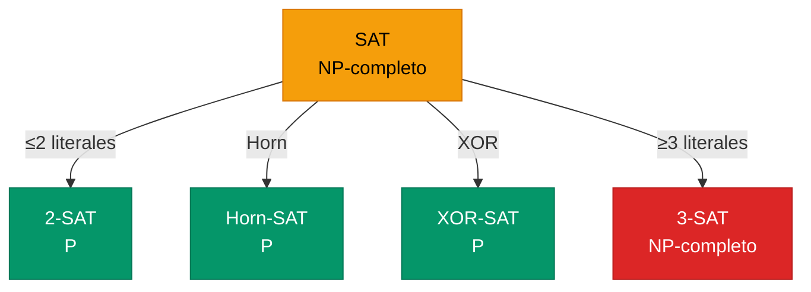

# Satisfacibilidad y SAT

El problema computacional central de la lógica.

## Satisfacibilidad, Validez y Conceptos Relacionados

### Definiciones

| Concepto | Definición | Ejemplo |
|----------|------------|---------|
| **Satisfacible** | Verdadera en **algún** modelo | $P \land Q$ |
| **Insatisfacible** | Falsa en **todos** los modelos | $P \land \neg P$ |
| **Válida (Tautología)** | Verdadera en **todos** los modelos | $P \lor \neg P$ |
| **Contingente** | Satisfacible pero no válida | $P$ |

### Relaciones



### Relación con Entailment

$$\alpha \models \beta \iff (\alpha \land \neg\beta) \text{ es insatisfacible}$$

$$\alpha \text{ es válida} \iff \neg\alpha \text{ es insatisfacible}$$

:::example{title="Clasificación de Fórmulas"}

| Fórmula | Satisfacible | Válida | Insatisfacible |
|---------|:------------:|:------:|:--------------:|
| $P \land \neg P$ | ✗ | ✗ | ✓ |
| $P \lor \neg P$ | ✓ | ✓ | ✗ |
| $P \rightarrow P$ | ✓ | ✓ | ✗ |
| $P$ | ✓ | ✗ | ✗ |
| $P \land Q$ | ✓ | ✗ | ✗ |

:::

---

## El Problema SAT

**SAT** (Boolean Satisfiability Problem):

> Dada una fórmula proposicional $\phi$, ¿existe una asignación de valores de verdad que haga $\phi$ verdadera?

### Entrada y Salida

- **Entrada:** Fórmula en CNF
- **Salida:** 
  - "SATISFACIBLE" + modelo que satisface, o
  - "INSATISFACIBLE"

### Ejemplo

**Entrada:** $(P \lor Q) \land (\neg P \lor R) \land (\neg Q \lor \neg R)$

**Proceso:** Buscar asignación...

**Salida:** SATISFACIBLE, modelo: $\{P=T, Q=F, R=T\}$

Verificación:
- $(T \lor F) = T$ ✓
- $(F \lor T) = T$ ✓
- $(T \lor F) = T$ ✓

---

## SAT es NP-Completo

### Teorema de Cook-Levin (1971)

> SAT es **NP-completo**.

Esto significa:
1. SAT está en NP (se puede verificar una solución en tiempo polinomial)
2. Todo problema en NP se puede reducir a SAT en tiempo polinomial

### Implicaciones

| Si... | Entonces... |
|-------|-------------|
| P = NP | SAT tiene algoritmo polinomial |
| P ≠ NP | SAT no tiene algoritmo polinomial |

**Estado actual:** No sabemos si P = NP (problema del millón de dólares).

### ¿Qué tan difícil es NP-completo?

| Símbolos | Modelos posibles | Tiempo (1M modelos/seg) |
|----------|------------------|-------------------------|
| 10 | ~1,000 | < 1 ms |
| 20 | ~1,000,000 | 1 segundo |
| 30 | ~1,000,000,000 | 17 minutos |
| 40 | ~1 billón | 12 días |
| 50 | ~1,000 billones | 35 años |
| 100 | ~10^30 | edad del universo × 10^12 |

---

## Algoritmos para SAT

### 1. Fuerza Bruta

```python
def brute_force_sat(formula, symbols):
    """
    Prueba todas las 2^n asignaciones.
    """
    if not symbols:
        return evaluate(formula, {})
    
    p = symbols[0]
    rest = symbols[1:]
    
    # Probar p = True
    if brute_force_sat(formula.substitute(p, True), rest):
        return True
    # Probar p = False
    if brute_force_sat(formula.substitute(p, False), rest):
        return True
    
    return False
```

**Complejidad:** $O(2^n)$ — impracticable para n > 30.

### 2. DPLL (Davis-Putnam-Logemann-Loveland)

Mejora sobre fuerza bruta con tres optimizaciones:

#### Propagación de Unidad (Unit Propagation)

Si una cláusula tiene un solo literal sin asignar, ese literal **debe** ser verdadero.

**Ejemplo:**
- Cláusulas: $(P)$, $(\neg P \lor Q)$, $(R \lor \neg Q)$
- $(P)$ es unitaria → $P = True$
- Propagando: $(\neg P \lor Q)$ → $(Q)$ es unitaria → $Q = True$
- Propagando: $(R \lor \neg Q)$ → $(R)$... y así sucesivamente

#### Eliminación de Literales Puros

Si un literal aparece solo en una polaridad (solo positivo o solo negativo), asignarlo para satisfacer todas sus cláusulas.

**Ejemplo:**
- Si $R$ aparece solo como $R$ (nunca $\neg R$), asignar $R = True$

#### Early Termination

- Si todas las cláusulas son verdaderas → SATISFACIBLE
- Si alguna cláusula es vacía (todos sus literales falsos) → INSATISFACIBLE en esta rama

```python
def dpll(clauses, symbols, model):
    """
    Algoritmo DPLL para SAT.
    """
    # Early termination
    if all(is_true(c, model) for c in clauses):
        return True, model
    if any(is_false(c, model) for c in clauses):
        return False, None
    
    # Unit propagation
    unit = find_unit_clause(clauses, model)
    if unit:
        return dpll(clauses, symbols - {unit.var}, 
                    {**model, unit.var: unit.sign})
    
    # Pure literal
    pure = find_pure_literal(clauses, model)
    if pure:
        return dpll(clauses, symbols - {pure.var},
                    {**model, pure.var: pure.sign})
    
    # Branching
    p = choose_symbol(symbols)
    rest = symbols - {p}
    
    result, m = dpll(clauses, rest, {**model, p: True})
    if result:
        return True, m
    
    return dpll(clauses, rest, {**model, p: False})
```

### 3. CDCL (Conflict-Driven Clause Learning)

Los SAT solvers modernos usan CDCL, que extiende DPLL con:

| Técnica | Descripción |
|---------|-------------|
| **Clause Learning** | Cuando hay conflicto, aprender nueva cláusula que evita el mismo conflicto |
| **Non-chronological Backtracking** | Retroceder más de un nivel cuando se aprende |
| **Watched Literals** | Detectar cláusulas unitarias eficientemente |
| **Restarts** | Reiniciar búsqueda periódicamente, conservando cláusulas aprendidas |
| **Heurísticas de decisión** | VSIDS, etc. para elegir qué variable asignar |

### Rendimiento Real

A pesar de ser NP-completo, los SAT solvers modernos resuelven instancias con **millones de variables** en segundos.


| SAT Solver | Año | Variables resueltas |
|------------|-----|---------------------|
| GRASP | 1996 | ~1,000 |
| Chaff | 2001 | ~100,000 |
| MiniSat | 2003 | ~500,000 |
| CryptoMiniSat | 2009 | ~1,000,000+ |
| Kissat | 2020 | 10,000,000+ |

---

## Casos Especiales Eficientes

### 2-SAT

Si todas las cláusulas tienen **a lo más 2 literales**:
- **2-SAT ∈ P** — ¡resoluble en tiempo lineal!
- Algoritmo: Construir grafo de implicaciones, buscar componentes fuertemente conexos

### Horn-SAT

Si todas las cláusulas son **cláusulas de Horn**:
- **Horn-SAT ∈ P** — resoluble en tiempo lineal
- Algoritmo: Forward chaining

### XOR-SAT

Conjunción de cláusulas XOR:
- **XOR-SAT ∈ P** — eliminación Gaussiana



---

## Aplicaciones de SAT

SAT solvers se usan en muchas áreas:

| Área | Aplicación |
|------|------------|
| **Hardware** | Verificación de circuitos, equivalencia de diseños |
| **Software** | Model checking, bug finding |
| **Seguridad** | Análisis de protocolos, criptoanálisis |
| **Planificación** | Planning as satisfiability |
| **Bioinformática** | Haplotyping, análisis de redes |
| **Scheduling** | Asignación de recursos, timetabling |
| **Sudoku** | ¡Resolver Sudoku como SAT! |

:::example{title="Sudoku como SAT"}

Variables: $x_{r,c,v}$ = "celda (r,c) tiene valor v"

Restricciones (cláusulas):
1. Cada celda tiene al menos un valor: $x_{r,c,1} \lor x_{r,c,2} \lor \cdots \lor x_{r,c,9}$
2. Cada celda tiene a lo más un valor: $\neg x_{r,c,i} \lor \neg x_{r,c,j}$ para $i \neq j$
3. Cada fila tiene cada número: ...
4. Cada columna tiene cada número: ...
5. Cada caja 3×3 tiene cada número: ...
6. Celdas pre-llenadas: $x_{r,c,v}$ (cláusulas unitarias)

¡Un SAT solver resuelve cualquier Sudoku en milisegundos!

:::

---

## Más Allá de SAT

### MaxSAT

Encontrar asignación que satisface el **máximo número** de cláusulas.

### Weighted MaxSAT

Cláusulas tienen pesos; maximizar suma de pesos de cláusulas satisfechas.

### SMT (Satisfiability Modulo Theories)

SAT + teorías adicionales (aritmética, arrays, bit-vectors, etc.)

**Ejemplo SMT:**
$$(x > 5) \land (y < 3) \land (x + y = 7)$$

No es lógica proposicional pura, pero SMT solvers lo manejan.

---

## Ejercicios

:::exercise{title="Clasificación" difficulty="1"}

Clasifica cada fórmula como Válida, Satisfacible (no válida), o Insatisfacible:

1. $(P \rightarrow Q) \lor (Q \rightarrow P)$
2. $P \land (P \rightarrow Q) \land \neg Q$
3. $(P \land Q) \rightarrow P$
4. $P \leftrightarrow \neg P$

:::

<details>
<summary><strong>Ver Solución</strong></summary>

1. $(P \rightarrow Q) \lor (Q \rightarrow P)$
   
   | P | Q | P→Q | Q→P | Fórmula |
   |---|---|-----|-----|---------|
   | T | T | T | T | T |
   | T | F | F | T | T |
   | F | T | T | F | T |
   | F | F | T | T | T |
   
   **Válida (Tautología)** ✓

2. $P \land (P \rightarrow Q) \land \neg Q$
   
   Simplificando: $P \land (\neg P \lor Q) \land \neg Q$
   
   Si P=T: necesitamos Q (de $\neg P \lor Q$) pero también $\neg Q$. Contradicción.
   Si P=F: $P \land ...$ es falso.
   
   **Insatisfacible** ✓

3. $(P \land Q) \rightarrow P$
   
   Equivalente a $\neg(P \land Q) \lor P = \neg P \lor \neg Q \lor P = True$
   
   **Válida (Tautología)** ✓

4. $P \leftrightarrow \neg P$
   
   P=T: T ↔ F = F
   P=F: F ↔ T = F
   
   **Insatisfacible** ✓

</details>

---

:::exercise{title="Reducción a SAT" difficulty="2"}

Tienes 3 tareas (A, B, C) y 2 empleados (1, 2). Cada tarea debe asignarse a exactamente un empleado. Además:
- El empleado 1 no puede hacer A y B ambas
- Si el empleado 2 hace C, también debe hacer A

Formaliza como SAT (define variables y cláusulas).

:::

<details>
<summary><strong>Ver Solución</strong></summary>

**Variables:** $x_{t,e}$ = "tarea t asignada a empleado e"
- $x_{A,1}, x_{A,2}, x_{B,1}, x_{B,2}, x_{C,1}, x_{C,2}$

**Restricciones:**

1. Cada tarea a al menos un empleado:
   - $(x_{A,1} \lor x_{A,2})$
   - $(x_{B,1} \lor x_{B,2})$
   - $(x_{C,1} \lor x_{C,2})$

2. Cada tarea a lo más un empleado:
   - $(\neg x_{A,1} \lor \neg x_{A,2})$
   - $(\neg x_{B,1} \lor \neg x_{B,2})$
   - $(\neg x_{C,1} \lor \neg x_{C,2})$

3. Empleado 1 no puede hacer A y B:
   - $\neg(x_{A,1} \land x_{B,1}) = (\neg x_{A,1} \lor \neg x_{B,1})$

4. Si empleado 2 hace C, también hace A:
   - $x_{C,2} \rightarrow x_{A,2} = (\neg x_{C,2} \lor x_{A,2})$

**CNF total:** Conjunción de las 8 cláusulas anteriores.

</details>

---

:::exercise{title="DPLL Manual" difficulty="3"}

Aplica DPLL (a mano) a:
$$(P \lor Q) \land (\neg P \lor R) \land (\neg Q) \land (\neg R \lor S)$$

:::

<details>
<summary><strong>Ver Solución</strong></summary>

**Cláusulas iniciales:**
1. $(P \lor Q)$
2. $(\neg P \lor R)$
3. $(\neg Q)$ ← **unitaria**
4. $(\neg R \lor S)$

**Paso 1:** Unit propagation con $(\neg Q)$
- Asignar $Q = False$
- Cláusula (1) se simplifica: $(P)$ ← **nueva unitaria**

**Paso 2:** Unit propagation con $(P)$
- Asignar $P = True$
- Cláusula (2) se simplifica: $(R)$ ← **nueva unitaria**

**Paso 3:** Unit propagation con $(R)$
- Asignar $R = True$
- Cláusula (4) se simplifica: $(S)$ ← **nueva unitaria**

**Paso 4:** Unit propagation con $(S)$
- Asignar $S = True$
- Todas las cláusulas satisfechas

**Resultado:** SATISFACIBLE
**Modelo:** $\{P=T, Q=F, R=T, S=T\}$

Verificación:
- $(T \lor F) = T$ ✓
- $(F \lor T) = T$ ✓
- $(T) = T$ ✓ (ya simplificada)
- $(F \lor T) = T$ ✓

</details>

---

:::exercise{title="¿Cuándo es fácil?" difficulty="2"}

¿Cuáles de las siguientes están en P?

1. 2-SAT
2. 3-SAT
3. Horn-SAT
4. CNF donde cada cláusula tiene exactamente 47 literales

:::

<details>
<summary><strong>Ver Solución</strong></summary>

1. **2-SAT** → **P** ✓ (algoritmo lineal basado en componentes fuertemente conexos)

2. **3-SAT** → **NP-completo** ✗ (el problema de referencia para NP-completitud)

3. **Horn-SAT** → **P** ✓ (forward chaining en tiempo lineal)

4. **47-SAT** → **NP-completo** ✗ (cualquier k-SAT con k≥3 es NP-completo)

La frontera está entre k=2 (P) y k≥3 (NP-completo).

</details>

---

:::prompt{title="Entender SAT" for="Claude/ChatGPT"}

Quiero entender mejor SAT y su importancia. Por favor:

1. Explícame intuitivamente por qué SAT es NP-completo
2. Dame un ejemplo de cómo reducir un problema del mundo real a SAT
3. Explica por qué los SAT solvers funcionan bien en la práctica a pesar de NP-completitud
4. ¿Qué pasa si P=NP se demuestra verdadero?

Usa ejemplos concretos y evita jerga innecesaria.

:::

---

## Puntos Clave

1. **Satisfacible** = verdadera en algún modelo; **Válida** = verdadera en todos
2. $\alpha \models \beta \iff \alpha \land \neg\beta$ insatisfacible
3. **SAT es NP-completo** — no hay algoritmo polinomial conocido
4. **DPLL** mejora fuerza bruta con: unit propagation, pure literal, early termination
5. **SAT solvers modernos** (CDCL) resuelven millones de variables en práctica
6. **2-SAT** y **Horn-SAT** están en **P** — casos especiales eficientes
7. SAT tiene aplicaciones en verificación, planificación, seguridad, etc.
