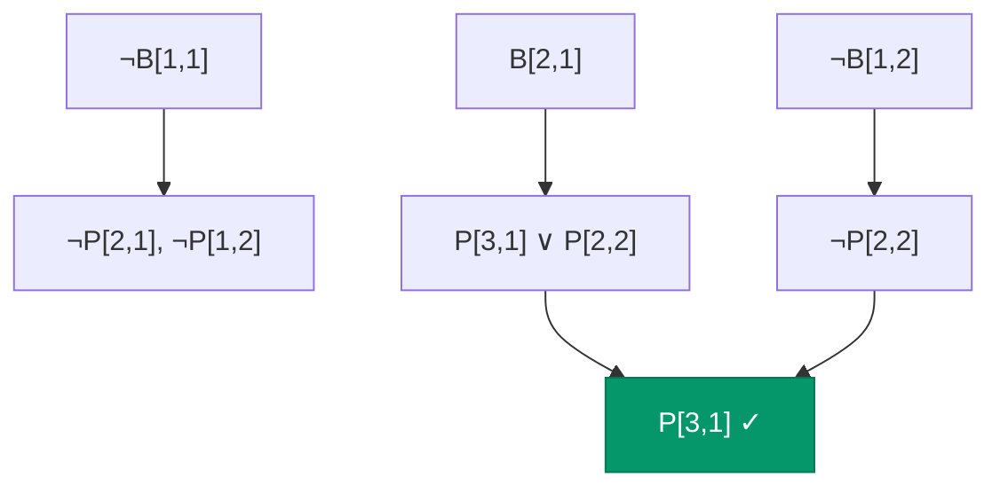

# Agentes Basados en Conocimiento: Wumpus World

Aplicando lógica proposicional a un problema clásico de IA.

## El Wumpus World

El **Wumpus World** es un entorno clásico de IA introducido por Gregory Yob en 1973 y usado en AIMA como ejemplo canónico.

### Descripción del Entorno


El agente está en una cueva de 4×4 celdas con:

| Elemento | Descripción | Cantidad |
|----------|-------------|----------|
| **Wumpus** | Monstruo que mata al agente | 1 |
| **Pozos** | Agujeros que matan al agente | Varios |
| **Oro** | El objetivo del agente | 1 |
| **Agente** | Empieza en [1,1], mirando derecha | 1 |

### PEAS del Wumpus World

| Componente | Descripción |
|------------|-------------|
| **Performance** | +1000 oro, -1000 muerte, -1 por acción, -10 por flecha |
| **Environment** | Cueva 4×4, parcialmente observable |
| **Actuators** | Forward, TurnLeft, TurnRight, Grab, Shoot, Climb |
| **Sensors** | Stench, Breeze, Glitter, Bump, Scream |

### Percepciones

| Percept | Significado | Ubicación |
|---------|-------------|-----------|
| **Stench** | Wumpus adyacente (no diagonal) | Celdas adyacentes al Wumpus |
| **Breeze** | Pozo adyacente | Celdas adyacentes a pozos |
| **Glitter** | Oro en la celda actual | Celda con oro |
| **Bump** | Chocó contra pared | Después de Forward contra pared |
| **Scream** | Wumpus muerto | Cuando flecha mata al Wumpus |

### Propiedades del Entorno

| Propiedad | Valor | Razón |
|-----------|-------|-------|
| Observable | **Parcial** | Solo percibe la celda actual |
| Determinista | **Sí** | Acciones tienen efectos predecibles |
| Episódico | **No** | Decisiones afectan el futuro |
| Estático | **Sí** | Wumpus y pozos no se mueven |
| Discreto | **Sí** | Estados y acciones finitos |
| Single-agent | **Sí** | Solo el agente actúa |

---

## ¿Por Qué Lógica?

Un **Simple Reflex Agent** no funciona aquí:

```python
# Esto NO funciona
def simple_reflex_wumpus(percept):
    if percept.glitter:
        return 'Grab'
    if percept.breeze:
        return 'TurnAround'  # ¿A dónde?
    return 'Forward'  # ¿Es seguro?
```

**Problema:** El agente no puede saber si una celda es segura sin **razonar** sobre múltiples percepciones.

### Ejemplo de Razonamiento Necesario


**Situación:**
- En [1,1]: Sin brisa, sin hedor
- En [2,1]: Brisa

**Razonamiento:**
1. Sin brisa en [1,1] → No hay pozo en [1,2] ni [2,1]
2. Brisa en [2,1] → Hay pozo en [1,1], [2,2], o [3,1]
3. [1,1] no tiene pozo (el agente empezó ahí)
4. [2,2] o [3,1] tiene pozo — pero ¿cuál?

Este razonamiento requiere **combinar información** de múltiples estados.

---

## Representación en Lógica Proposicional

### Símbolos Proposicionales

| Símbolo | Significado |
|---------|-------------|
| $P_{x,y}$ | Hay un pozo en [x,y] |
| $W_{x,y}$ | El Wumpus está en [x,y] |
| $B_{x,y}$ | Brisa percibida en [x,y] |
| $S_{x,y}$ | Hedor percibido en [x,y] |
| $V_{x,y}$ | [x,y] ha sido visitada |
| $OK_{x,y}$ | [x,y] es segura |

### Conocimiento del Mundo

**Regla de la Brisa:**
"Hay brisa en [x,y] si y solo si hay un pozo adyacente"

$$B_{x,y} \leftrightarrow (P_{x-1,y} \lor P_{x+1,y} \lor P_{x,y-1} \lor P_{x,y+1})$$

Para cada celda del grid.

**Regla del Hedor:**
$$S_{x,y} \leftrightarrow (W_{x-1,y} \lor W_{x+1,y} \lor W_{x,y-1} \lor W_{x,y+1})$$

**Unicidad del Wumpus:**
"Hay exactamente un Wumpus"

$$W_{1,1} \lor W_{1,2} \lor \cdots \lor W_{4,4}$$

Y para cada par $(i,j) \neq (k,l)$:
$$\neg W_{i,j} \lor \neg W_{k,l}$$

**Seguridad:**
$$OK_{x,y} \leftrightarrow \neg P_{x,y} \land \neg W_{x,y}$$

---

## Ejemplo de Inferencia

### Escenario


**Estado inicial:**
- Agente en [1,1]
- Percibe: Sin brisa, sin hedor, sin brillo

### Paso 1: Procesar percepciones en [1,1]

**Añadir a KB:**
- $\neg B_{1,1}$ (sin brisa)
- $\neg S_{1,1}$ (sin hedor)

### Paso 2: Inferir sobre celdas adyacentes

**De la regla de brisa:**
$$B_{1,1} \leftrightarrow (P_{0,1} \lor P_{2,1} \lor P_{1,0} \lor P_{1,2})$$

Dado que $\neg B_{1,1}$:
$$\neg(P_{0,1} \lor P_{2,1} \lor P_{1,0} \lor P_{1,2})$$

Por De Morgan:
$$\neg P_{0,1} \land \neg P_{2,1} \land \neg P_{1,0} \land \neg P_{1,2}$$

**Conclusión:** No hay pozos en las celdas adyacentes a [1,1].

(Ignorando las fuera del grid)
- $\neg P_{2,1}$ ✓
- $\neg P_{1,2}$ ✓

**Similarmente para el hedor:**
- $\neg W_{2,1}$ ✓
- $\neg W_{1,2}$ ✓

### Paso 3: Determinar celdas seguras

$$OK_{2,1} = \neg P_{2,1} \land \neg W_{2,1} = T \land T = T$$
$$OK_{1,2} = \neg P_{1,2} \land \neg W_{1,2} = T \land T = T$$

**[2,1] y [1,2] son seguras!**

### Paso 4: Mover a [2,1]

**Percibe:** Brisa

**Añadir a KB:** $B_{2,1}$

**De la regla de brisa:**
$$B_{2,1} \leftrightarrow (P_{1,1} \lor P_{3,1} \lor P_{2,0} \lor P_{2,2})$$

Sabemos:
- $\neg P_{1,1}$ (el agente empezó ahí)
- $P_{2,0}$ está fuera del grid

Por lo tanto:
$$P_{3,1} \lor P_{2,2}$$

**Hay un pozo en [3,1] o [2,2] (o ambos), pero no sabemos cuál.**

### Paso 5: Explorar más

Regresamos a [1,1] y vamos a [1,2].

**Percibe:** Sin brisa

$$\neg B_{1,2} \rightarrow \neg P_{1,1} \land \neg P_{2,2} \land \neg P_{1,3}$$

**¡Ahora sabemos $\neg P_{2,2}$!**

Combinando con $(P_{3,1} \lor P_{2,2})$:
$$P_{3,1}$$

**Conclusión:** ¡El pozo está en [3,1]!



---

## Algoritmo del Agente Lógico

```python
def logical_wumpus_agent(percept):
    """
    Agente basado en conocimiento para Wumpus World.
    """
    # 1. Añadir percepción a la KB
    TELL(KB, make_percept_sentence(percept, current_location, t))
    
    # 2. Preguntar qué celdas son seguras
    safe_cells = []
    for cell in adjacent(current_location):
        if not visited(cell):
            if ASK(KB, OK(cell)):
                safe_cells.append(cell)
    
    # 3. Decidir acción
    if percept.glitter:
        action = 'Grab'
    elif safe_cells:
        action = plan_route_to(random.choice(safe_cells))
    elif ASK(KB, some_cell_is_safe):
        # Backtrack a celda conocida y explorar desde ahí
        action = plan_route_to(find_safe_unvisited())
    else:
        # No hay opción segura — tomar riesgo calculado
        action = take_calculated_risk()
    
    # 4. Registrar acción
    TELL(KB, make_action_sentence(action, t))
    t = t + 1
    
    return action
```

---

## Limitaciones de la Lógica Proposicional

### Explosión de Símbolos

Para un grid de $n \times n$:
- $n^2$ símbolos para pozos
- $n^2$ símbolos para Wumpus
- $n^2$ símbolos para brisa
- ... y más para cada propiedad

Para 4×4: ~50+ símbolos y cientos de cláusulas.

### No Puede Expresar Generalizaciones

"Todas las celdas adyacentes a pozos tienen brisa" requiere escribir una regla para **cada celda**.

**Solución:** Lógica de Primer Orden (FOL) — fuera del alcance de este módulo.

### Incertidumbre

A veces sabemos $(P_{3,1} \lor P_{2,2})$ pero no podemos decidir cuál.

¿Qué hacer? 
- Explorar más para obtener información
- Tomar decisión probabilística (Clase 5)

---

## Ejercicios

:::exercise{title="Formalización Básica" difficulty="1"}

Escribe las cláusulas CNF para la regla de brisa en la celda [2,2]:
"Hay brisa en [2,2] si y solo si hay un pozo en [1,2], [3,2], [2,1], o [2,3]"

:::

<details>
<summary><strong>Ver Solución</strong></summary>

**Bicondicional:**
$$B_{2,2} \leftrightarrow (P_{1,2} \lor P_{3,2} \lor P_{2,1} \lor P_{2,3})$$

**Convertir a implicaciones:**
$$(B_{2,2} \rightarrow (P_{1,2} \lor P_{3,2} \lor P_{2,1} \lor P_{2,3}))$$
$$\land$$
$$((P_{1,2} \lor P_{3,2} \lor P_{2,1} \lor P_{2,3}) \rightarrow B_{2,2})$$

**Primera parte → CNF:**
$$\neg B_{2,2} \lor P_{1,2} \lor P_{3,2} \lor P_{2,1} \lor P_{2,3}$$

**Segunda parte → CNF:** (cada disyunto implica B)
$$(\neg P_{1,2} \lor B_{2,2})$$
$$\land (\neg P_{3,2} \lor B_{2,2})$$
$$\land (\neg P_{2,1} \lor B_{2,2})$$
$$\land (\neg P_{2,3} \lor B_{2,2})$$

**CNF Total (5 cláusulas):**
1. $\neg B_{2,2} \lor P_{1,2} \lor P_{3,2} \lor P_{2,1} \lor P_{2,3}$
2. $\neg P_{1,2} \lor B_{2,2}$
3. $\neg P_{3,2} \lor B_{2,2}$
4. $\neg P_{2,1} \lor B_{2,2}$
5. $\neg P_{2,3} \lor B_{2,2}$

</details>

---

:::exercise{title="Inferencia Manual" difficulty="2"}

Dado:
- $\neg B_{1,1}$ (sin brisa en [1,1])
- $B_{2,1}$ (brisa en [2,1])
- $\neg B_{1,2}$ (sin brisa en [1,2])

Y las reglas de brisa para [1,1], [2,1], [1,2].

Determina qué puedes inferir sobre $P_{2,2}$ y $P_{3,1}$.

:::

<details>
<summary><strong>Ver Solución</strong></summary>

**De $\neg B_{1,1}$:**
Los pozos adyacentes a [1,1] son [2,1] y [1,2] (ignorando fuera del grid).
$$\neg B_{1,1} \rightarrow \neg P_{2,1} \land \neg P_{1,2}$$

**De $\neg B_{1,2}$:**
Los pozos adyacentes a [1,2] son [1,1], [2,2], [1,3].
$$\neg B_{1,2} \rightarrow \neg P_{1,1} \land \neg P_{2,2} \land \neg P_{1,3}$$

Obtenemos: $\neg P_{2,2}$ ✓

**De $B_{2,1}$:**
Los pozos adyacentes a [2,1] son [1,1], [3,1], [2,2].
$$B_{2,1} \rightarrow P_{1,1} \lor P_{3,1} \lor P_{2,2}$$

Sabemos:
- $\neg P_{1,1}$ (inicio seguro)
- $\neg P_{2,2}$ (derivado arriba)

Por lo tanto: $P_{3,1}$ ✓

**Conclusión:**
- $\neg P_{2,2}$ (seguro)
- $P_{3,1}$ (hay pozo)

</details>

---

:::exercise{title="Diseño de Agente" difficulty="3"}

Diseña la lógica para un agente Wumpus más sofisticado:

1. ¿Cómo representarías "el Wumpus podría estar en [x,y]"?
2. ¿Cómo decidirías cuándo disparar la flecha?
3. ¿Cómo manejarías la incertidumbre cuando hay múltiples ubicaciones posibles para el Wumpus?

Describe tu enfoque (no necesitas código completo).

:::

<details>
<summary><strong>Ver Solución</strong></summary>

**1. "El Wumpus podría estar en [x,y]":**

Usaríamos un símbolo adicional $PW_{x,y}$ (Possible Wumpus):
$$PW_{x,y} \leftrightarrow \neg \text{ASK}(KB, \neg W_{x,y})$$

Es decir, el Wumpus es posible en [x,y] si no podemos demostrar que NO está ahí.

Alternativamente, mantener un conjunto de modelos consistentes con las observaciones.

**2. Cuándo disparar:**

Disparar cuando:
- Sabemos exactamente dónde está el Wumpus: $KB \models W_{x,y}$
- O cuando una celda que necesitamos visitar es la única ubicación posible: 
  $|PossibleWumpusLocations| = 1$ y necesitamos pasar por ahí

También considerar:
- Solo tenemos una flecha
- El disparo cuesta -10
- Si el Wumpus bloquea el único camino al oro

**3. Manejar incertidumbre:**

Opciones:
a) **Conservador:** No ir a ninguna celda donde el Wumpus sea posible hasta confirmar su ubicación.

b) **Análisis de riesgo:** Si $n$ celdas son posibles ubicaciones del Wumpus, probabilidad de muerte al entrar en una es $1/n$. Decidir basado en utilidad esperada.

c) **Recopilación de información:** Ir a celdas seguras que nos den más información (hedor) para reducir incertidumbre.

d) **Uso estratégico de la flecha:** Si necesitamos pasar por celda posiblemente peligrosa, disparar "por si acaso" si la utilidad esperada lo justifica.

**Este análisis motiva la transición a razonamiento probabilístico (Clase 5).**

</details>

---

:::homework{id="wumpus-kb" title="Implementar KB del Wumpus" deadline="2025-02-14"}

Implementa en Python:

1. Una clase `WumpusKB` que represente el conocimiento del agente
2. Métodos `tell(sentence)` y `ask(query)` 
3. Las reglas básicas del Wumpus World (brisa, hedor)
4. Un método `safe_cells()` que retorne las celdas seguras conocidas

**Requisitos:**
- Usar representación CNF
- Implementar al menos Modus Ponens o Resolución simple
- Probar con el escenario del ejemplo (inferir ubicación del pozo)

**Entrega:**
- Código Python documentado
- Archivo de pruebas con al menos 3 escenarios
- Documento explicando tu diseño

:::

---

:::prompt{title="Explorar Wumpus World" for="Claude/ChatGPT"}

Quiero entender mejor el Wumpus World. Por favor:

1. Dame un escenario completo de 4x4 (ubicación de pozos, Wumpus, oro)
2. Simula paso a paso lo que percibiría el agente y qué podría inferir
3. Identifica puntos donde el agente tiene incertidumbre
4. Sugiere qué haría un agente óptimo en cada decisión

Usa una representación visual del grid en cada paso.

:::

---

## Conexión con el Resto del Curso

### Hacia Probabilidad (Clase 5)

El Wumpus World muestra las **limitaciones** de la lógica binaria:

| Situación | Lógica | Probabilidad |
|-----------|--------|--------------|
| "Pozo en [3,1] o [2,2]" | No puedo decidir | P([3,1]) = 0.5 |
| "Probablemente hay Wumpus" | No se puede expresar | P(Wumpus) = 0.8 |
| "¿Vale la pena el riesgo?" | No tiene utilidad | Utilidad esperada |

### Hacia Planificación

El Wumpus World también es un problema de **planificación**:
- Estado inicial: [1,1], sin oro
- Estado objetivo: [1,1], con oro, vivo
- Acciones: Forward, Turn, Grab, Climb

**Planning as Satisfiability** codifica el problema como SAT.

---

## Puntos Clave

1. **Wumpus World** es un entorno clásico para agentes basados en conocimiento
2. **Simple Reflex** no funciona — se necesita **razonamiento**
3. Representamos el mundo con símbolos: $P_{x,y}$, $W_{x,y}$, $B_{x,y}$, etc.
4. Las **reglas** (brisa ↔ pozo adyacente) codifican conocimiento del dominio
5. El agente **infiere** hechos combinando percepciones y reglas
6. La lógica proposicional tiene **limitaciones**: explosión de símbolos, no generaliza, incertidumbre
7. El Wumpus World **motiva** probabilidad (Clase 5) y planificación
